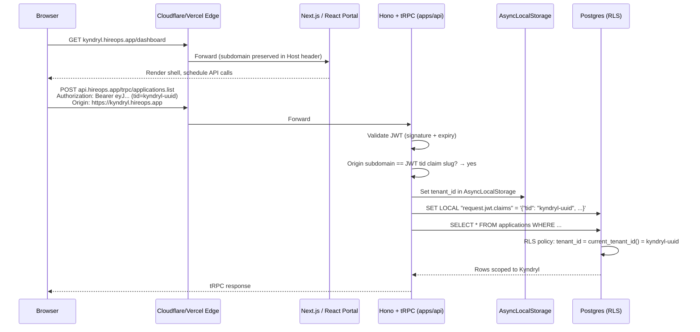
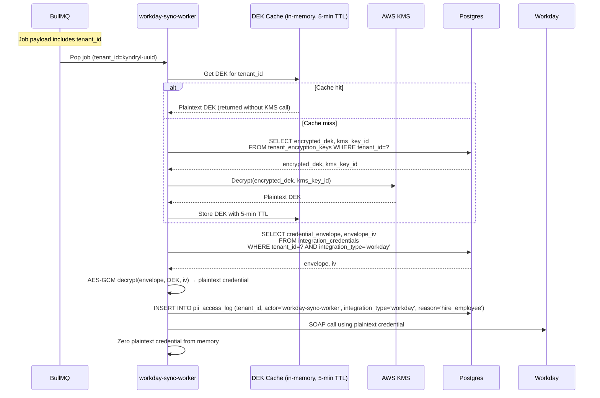
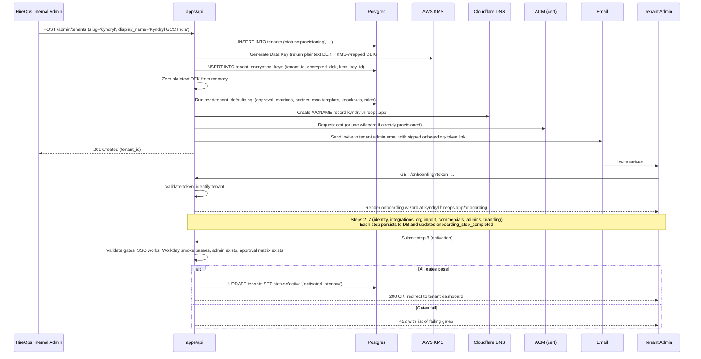

# ADR-002: Multi-Tenancy Architecture

**Status:** Proposed (awaiting platform team review)
**Date:** 9 May 2026
**Author:** HireOps Engineering
**Decision drivers:** Engineering Lead, Platform Architect
**Stakeholders:** Product, Security, DevOps, Customer Onboarding (future)
**Supersedes:** None
**Related:** `requirements.md` §1.5 (product positioning), `architecture.md` §1 + §1.1 (multi-tenancy as foundational principle), `workday-adr.md` (per-tenant integration credentials downstream of this ADR), `partner-data-model.md` (tenant scoping composes with partner-org scoping)

---

## 1. Context

HireOps is a multi-tenant SaaS platform. The product is sold to enterprise hirers — primarily GCCs, Indian enterprises, and SE-Asian high-volume hirers — who each become a tenant on shared platform infrastructure. Kyndryl's GCC POC funds the initial build; on successful POC, Kyndryl becomes Tenant #1 in production and additional enterprises follow. The product positioning is locked in `requirements.md` §1.5, and the foundational principle ("one codebase, one deployment, many tenants — isolated by `tenant_id`-scoped RLS and per-tenant integration credentials") is locked in `architecture.md` §1.1.

This ADR makes the architecture concrete. Six interlocking decisions define how multi-tenancy actually works in HireOps:

1. **Tenant isolation model** — where tenant data lives and how it is bounded.
2. **Tenant identification** — how a request is mapped to a tenant.
3. **RLS pattern** — how the database enforces the tenant boundary alongside role/persona scoping.
4. **Configuration model** — how per-tenant settings, behaviour-driving config, and defaults are stored.
5. **Per-tenant integration credentials** — how third-party secrets (Workday ISU, BGV API keys, IdP config) are isolated and encrypted.
6. **Tenant onboarding** — how a new tenant is brought online as a product workflow.

Every subsequent platform decision descends from these six. The Workday integration (`workday-adr.md`) assumes per-tenant credential storage and per-tenant `workday_sync_jobs`. The partner data model (`/docs/partner-data-model.md`) assumes tenant scoping composes with the partner-org scoping it already specifies. The recruitment, onboarding, and offboarding flows in `requirements.md` all assume tenant-scoped reads at the database boundary. Until this ADR lands, every other doc in `/docs/` describes the platform as if for a single tenant; this ADR removes that simplification and replaces it with the SaaS-shaped truth.

The decisions below are not presented as open questions. They have been recommended and accepted by the engineering team. This document writes them up with the options-considered context, consequences, and detailed design needed to implement them with discipline.

---

## 2. Decision

We will operate HireOps as a multi-tenant SaaS on a **shared database, shared schema** with `tenant_id` on every domain table and Postgres Row Level Security policies enforcing tenant boundaries at the database boundary. Tenants are addressed by **subdomain** (`{slug}.hireops.app`) for routing and branding, with the **JWT `tid` custom claim** as the authoritative tenant scope. RLS policies follow a **tenant-then-role composition pattern** with `current_tenant_id()` as a SECURITY DEFINER helper that nests cleanly inside Lovable's existing `has_role()` function. Per-tenant configuration uses a **hybrid model**: typed tables for behaviour-driving config (approval matrices, fee schedules, document types, knockout templates) and a `tenant_settings` JSONB column for cosmetic config (logo, brand colour, locale). Per-tenant integration credentials (Workday ISU, BGV API keys, IdP secrets) use **envelope encryption with per-tenant Data Encryption Keys** wrapped by a master KMS Key Encryption Key. Tenant onboarding is a **multi-step product workflow** shipped from day one; the HireOps team uses it to provision Kyndryl as Tenant #1 and uses the same flow for every customer thereafter.

We will **not** maintain schema-per-tenant or database-per-tenant in the POC. We will **not** rely on application-layer filtering alone — RLS is the safety net. We will **not** ship per-tenant code paths or per-customer forks of any module. We will **not** treat tenant onboarding as a one-time consulting engagement.

---

## 3. Options considered

Three of the six decisions had genuine option-space worth weighing (1, 2, 4). The other three (RLS pattern, integration credential encryption, onboarding flow) are derivative — they describe the chosen approach rather than picking between alternatives, and so are written up only in §5 Detailed design.

### 3.1 Decision 1 — Tenant isolation model

#### Option A: Shared database, shared schema, `tenant_id` column with RLS — **CHOSEN**

One Postgres database, one schema, every domain table carries a `tenant_id` column. Postgres RLS policies enforce tenant boundaries at the database level. The pattern used by Slack, Notion, Linear, Ashby, Greenhouse, and most modern multi-tenant SaaS.

| Pros | Cons |
|---|---|
| Lowest ops cost: one Postgres to run, monitor, back up, PITR-restore | Cross-tenant data leakage is one bad RLS policy away — discipline is non-negotiable |
| Best economies of scale as tenants grow — adding a tenant is `INSERT INTO tenants` plus credential setup, not infrastructure provisioning | Noisy-neighbour risk if one tenant runs heavy queries — needs query observability + per-tenant rate limiting |
| Mature pattern; large body of production experience and well-documented failure modes | RLS performance is sensitive to indexing — every `tenant_id` column needs an index, every hot composite needs `tenant_id` as a leading column |
| Composes cleanly with Lovable's existing `has_role()` SECURITY DEFINER pattern — tenant scoping becomes the outermost predicate, role scoping nests inside | Some kinds of cross-tenant analytics (e.g., aggregate platform usage) require service-role queries, which need their own audit discipline |
| Supabase explicitly supports this (Postgres + RLS is the platform's primary tenancy story) | Schema migrations affect all tenants simultaneously — no tenant-by-tenant rollout without feature flags |
| RLS performance is equivalent to application-level WHERE clauses when `tenant_id` is indexed (per Postgres docs and Supabase production guidance) | |

#### Option B: Shared database, schema-per-tenant

Each tenant gets their own Postgres schema; tables are duplicated per schema; the connection's `search_path` switches per request.

| Pros | Cons |
|---|---|
| Slightly stronger isolation: a missed RLS policy can't leak across schemas because the schema isn't on the search path | Schema migrations across hundreds of schemas become operational complexity (run the same migration 200 times; one fails halfway through; now you have schema drift) |
| Per-tenant pg_stat is naturally segmented | Cross-tenant analytics become harder — every aggregate query has to enumerate schemas |
| Supports per-tenant table-level customisation (which we explicitly do not want — see Decision 4) | Connection-pool churn: pools have to track `search_path` per checkout; misconfigured pooler leaks across tenants |
| | Ops cost similar to Option A but with extra complexity for no isolation gain that A's RLS doesn't already give us |

#### Option C: Database-per-tenant

Each tenant gets their own Postgres database (or cluster). Maximum isolation.

| Pros | Cons |
|---|---|
| Maximum isolation: a Postgres bug, a noisy neighbour, or a credential leak is bounded to one tenant | Expensive at scale: one Postgres per tenant means one connection pool, one PITR, one monitor, one backup target each |
| Per-tenant region placement is trivial (each DB lives wherever the tenant lives) | Provisioning takes minutes (database create, role create, schema migrate, RLS bootstrap) — incompatible with self-service onboarding |
| Compliance-friendly for regulated industries (healthcare, finance) | Cross-tenant analytics require fan-out queries or a separate warehouse |
| | Code paths must handle "which DB does this tenant live in?" — adds a layer of routing complexity |
| | Not a fit for our customer profile (GCCs, Indian enterprises, SE-Asian hirers) — none have compliance posture that demands physical DB isolation today |

#### Option D: Hybrid (most tenants on shared, large/regulated tenants on dedicated)

Default to Option A; promote specific tenants to Option C when they justify it.

| Pros | Cons |
|---|---|
| Best of both worlds in theory | Worst of both worlds in practice: every migration script has to handle two patterns; every monitoring dashboard has to handle two patterns; every operational runbook has two branches |
| Allows enterprise-tier pricing differentiation | Defer this until a real customer demands it — premature complexity |
| | Migration path from A to "A + occasional C" exists and is option-preserving (see §8) |

**Why Option A wins.** Lowest ops cost, best economies of scale, mature production-pattern with well-documented failure modes, composes with the auth/role pattern already in Lovable, and option-preserving (we can add C later for compliance-driven tenants without ripping up A). The headline cost — RLS discipline — is mitigated by the testing and migration patterns specified in §5.3.

**Migration path.** If a future customer needs database-per-tenant for compliance reasons, that becomes a region-specific deployment running the same codebase against a dedicated database. The `tenant_id` column doesn't go away; it just always has the same value in that deployment. Moving from A to a hybrid A+C is a deployment change, not a code change. Documented in §8.

### 3.2 Decision 2 — Tenant identification

#### Option A: Subdomain (visible) + JWT claim (authoritative) — **CHOSEN**

Tenants address by `{slug}.hireops.app` for the user-facing surface. The auth-time tenant scope comes from a `tid` custom claim in the JWT issued by Supabase Auth at login.

| Pros | Cons |
|---|---|
| Visual clarity: users see they're in their tenant's surface ("acme.hireops.app") | Wildcard DNS + wildcard TLS certificate management — one-time setup cost |
| Cookies and sessions isolate naturally per subdomain — no risk of cross-tenant cookie leakage in the browser | Local development needs a wildcard hosts entry or `localtest.me`-style trick |
| Per-tenant white-labelling lands cleanly (subdomain is the natural carrier for branded chrome) | More complex DNS story than path-based |
| Vercel + Cloudflare wildcard domains have well-documented production patterns | |
| Future BYOD (Bring Your Own Domain — `careers.kyndryl.com` mapping to a HireOps tenant) is a configuration change, not a re-architecture | |
| Defensive layering: subdomain is the routing convenience, JWT is the security boundary — a malicious user visiting `acme.hireops.app` with a Kyndryl JWT cannot read Acme data because the JWT's `tid` doesn't match | |

#### Option B: URL path (`hireops.app/{slug}/...`) + JWT claim

Tenants live at `hireops.app/kyndryl/...` with the same JWT `tid` claim authoritative.

| Pros | Cons |
|---|---|
| Single domain, single TLS certificate — simpler DNS | Cookies are shared across all tenants (one HttpOnly session cookie covers `hireops.app`), so a cookie scoping bug is cross-tenant by default |
| Easier local development | White-labelling has to live in the page, not the URL — feels less like "the customer's product" |
| | BYOD is awkward (`careers.kyndryl.com/kyndryl/...` is ugly) |

#### Option C: Custom header + JWT claim

`X-Tenant-Id: kyndryl` on every request, JWT confirms.

| Pros | Cons |
|---|---|
| Zero DNS work | Browser users have no natural way to set custom headers; only viable for API consumers |
| Cleanest API design for B2B integrations | Useless for human-facing portals — those are 80% of HireOps usage |

#### Option D: JWT claim only (no subdomain or path)

The user logs in; the JWT carries `tid`; the surface is the same `hireops.app` for everyone, branded based on the active tenant.

| Pros | Cons |
|---|---|
| Simplest possible URL | Users in multiple tenants (consultants, partner-org admins on multiple panels) cannot have two tenants open simultaneously in the same browser |
| | Cookie isolation depends on path or domain scoping; harder to get right |
| | No natural BYOD path |

**Why Option A wins.** Visible tenant context for users, natural cookie isolation, BYOD-ready, and a clean separation between routing convenience (subdomain) and security boundary (JWT). The DNS/TLS overhead is a one-time platform cost, not a per-tenant cost.

### 3.3 Decision 4 — Configuration model

#### Option A: Hybrid — typed tables for behaviour, JSONB for cosmetics — **CHOSEN**

Behaviour-driving config (approval matrices, fee schedules, document types, knockout templates, role definitions, MSA terms) lives in typed tables. Cosmetic config (logo, brand colour, locale, date format, currency display) lives in a `tenant_settings` JSONB column on the `tenants` row.

| Pros | Cons |
|---|---|
| Behaviour-driving config is queryable, joinable, indexable — the hot paths can SQL-join into config without writing JSON-path expressions | Two storage patterns to remember — but the rule of thumb is clear (typed for behaviour, JSONB for cosmetics) |
| Schema migrations enforce consistency for behaviour-driving config across tenants | A few edge cases (per-tenant feature flags) sit awkwardly between the two — handled by deferral to a separate ADR |
| JSONB tolerates per-tenant cosmetic freedom without schema churn | |
| Existing `partner_msa`, `approval_chains`, `requisition_knockouts`, `document_types` tables already follow the typed pattern — Option A composes with them | |

#### Option B: All-JSONB — single `tenant_config` column

Every tenant setting in one big JSONB blob on the `tenants` row.

| Pros | Cons |
|---|---|
| Maximum schema flexibility — add new config without migrations | Hot paths have to write JSON-path queries against `tenant_config->'approvals'->'matrix'` — slow and error-prone |
| Trivial defaults inheritance (deep-merge) | No referential integrity — `tenant_config->'bgv_vendor'` could point at a string that no longer matches any supported vendor |
| | Config validation has to live in the application, not the database; bugs ship as bad data |
| | Cross-tenant analytics and admin tooling have to parse JSON instead of joining |

#### Option C: All-typed — tables for everything configurable

A typed table per configuration category, including cosmetic config (`tenant_branding`, `tenant_locale_settings`, etc.).

| Pros | Cons |
|---|---|
| Maximum referential integrity | Schema sprawl — every cosmetic tweak becomes a new table or column |
| Easiest to validate at the database layer | Migration overhead for cosmetic changes (add a brand-tagline field = migration) |
| | Doesn't actually buy us anything for cosmetic config — that data isn't joined or queried |

**Why Option A wins.** Right tool for each kind of config. Typed tables protect what matters (behaviour); JSONB tolerates what doesn't (cosmetics). The pattern is teachable in one sentence: "if it drives a query, type it; if it drives a render, JSONB it."

### 3.4 Decisions 3, 5, 6 — derivative decisions

Decision 3 (RLS pattern), Decision 5 (per-tenant integration credentials), and Decision 6 (tenant onboarding workflow) are derivative of Decisions 1, 2, and 4. There are not meaningfully different "options" for them once 1, 2, and 4 are fixed — the choice is between the documented design and worse versions of it. Their full design lives in §5 Detailed design rather than this Options section.

---

## 4. Consequences

### What this decision enables

- **Adding a tenant is a product workflow, not a deployment.** Insert a `tenants` row, generate a DEK, seed defaults, allocate a subdomain, send an admin invite. Onboarding a new customer is a feature, not an engineering project.
- **One codebase, one production deployment.** Engineering velocity scales with team size, not customer count. No per-customer forks or feature branches.
- **Tenant boundary enforced at the database.** Application bugs can't leak data across tenants because the policy denies the read before the application gets a chance to mishandle it.
- **Per-tenant integration credentials are isolated cryptographically.** A bug in RLS or a service-role key leak does not expose other tenants' Workday passwords or BGV API keys — those are encrypted with per-tenant DEKs that are unwrapped only at the moment of use.
- **Branded surfaces per tenant.** Subdomain identification + cosmetic JSONB config make per-tenant branding ship from day one without per-customer code.
- **Future region-per-tenant is option-preserving.** The data model accommodates a tenant attribute driving storage/compute placement; we don't ship that in Wave 1, but the schema doesn't paint us into a corner.

### What this decision costs

- **RLS discipline is non-negotiable.** Every new table needs an RLS policy in the same migration. Every hot query needs `tenant_id` in the WHERE clause and the index. The CI gate in §5.3 enforces this; the team has to live with it.
- **Cross-tenant operations need explicit service-role discipline.** Admin tools that aggregate across tenants run as service role and must include explicit `tenant_id` filters or tenant fan-outs — they do not benefit from RLS.
- **Wildcard DNS + wildcard TLS certificate setup is one-time platform overhead.** ACM-managed wildcard cert for `*.hireops.app`; Cloudflare/Vercel edge config; local-dev story (`localtest.me` or `/etc/hosts` wildcard).
- **Envelope encryption adds complexity to the credential read path.** A 5-minute DEK cache mitigates the per-call KMS overhead, but the operational story (KEK rotation, DEK rotation, audit) needs runbooks.
- **Tenant onboarding flow itself is a product feature with non-trivial cost.** Estimated 2-3 weeks of engineering for the V1 self-service onboarding wizard. For Wave 1, an internal-admin scripted flow ships first; the self-service wizard lands in Wave 2.

### Assumptions this decision makes

- Postgres + RLS is the database. If we ever migrate off Postgres, this ADR's correctness assumptions don't hold.
- Supabase Auth (or any IdP that issues JWTs with custom claims) is the auth tier. Custom-claim support is the linchpin.
- All domain tables are in the public schema. We do not use Postgres schemas for any other reason; the namespace is reserved for potential future schema-per-tenant migration.
- AWS KMS (or equivalent — GCP KMS, HashiCorp Vault) is the master-key store. The pattern works with any of them; we standardise on AWS KMS for the POC.
- Tenant count grows to hundreds, not thousands, in the first 18 months. At thousands of tenants the noisy-neighbour story needs revisiting (per-tenant connection pooling, query-level rate limiting); this ADR does not pre-solve for that scale.
- No tenant has a regulatory mandate for physical database isolation today. We will revisit when one shows up.

### Risks introduced

| Risk | Likelihood | Impact | Mitigation |
|---|---|---|---|
| RLS policy missing on a new table → cross-tenant data leak | Medium | Critical | CI gate that fails any migration adding a table without RLS enabled and a tenant policy; required code-review checklist; tenant-aware test utility (§5.3) |
| Composite index missing → tenant query becomes O(N) over the whole table | High | Medium (performance) | Index-presence linter on migrations; query-plan review for any new hot path; per-tenant query latency dashboard |
| Service-role key leaks → bypass RLS entirely | Low | Critical | Service role key in Vault, never in repo, never in client-side code; quarterly rotation; alert on use from non-worker IP ranges |
| KMS or Vault outage → credentials un-decryptable, integrations stop | Low | High | DEK cache (5-min TTL) tolerates short KMS outages; degraded-mode runbook (pause integration queue, surface to admin); multi-region KMS for production |
| Wildcard subdomain misconfiguration → tenant subdomain unreachable | Medium | Medium | Synthetic monitor per subdomain; tenant-onboarding step verifies subdomain reachability before activation |
| JWT `tid` claim absent from token (auth bug) → request defaults to "no tenant" | Low | High | Middleware rejects any authenticated request without a `tid` claim; defaults to 401, never to "all tenants" |
| Tenant onboarding flow buggy on first real customer (Kyndryl) | Medium | High | Internal-admin scripted onboarding ships first (Wave 1); Kyndryl is provisioned manually with full engineering attention; self-service wizard hardens through Wave 2 with internal customer (sandbox) drills first |
| Schema migration takes a tenant offline mid-migration | Medium | Medium | All migrations are designed to be online (no exclusive locks); long-running migrations gated behind feature flags; per-tenant maintenance window for high-risk migrations |
| KEK rotation forgotten / overdue → master key compromise blast radius widens | Low | High | Annual KEK rotation cron; alert if `tenant_encryption_keys.rotated_at < now() - 1 year` |

---

## 5. Detailed design

### 5.1 Tenant isolation model — schema and tables

Every domain table carries a `tenant_id UUID NOT NULL REFERENCES tenants(id)` column with an index. Every RLS policy on every domain table starts with `tenant_id = current_tenant_id()` as the outermost predicate.

```sql
CREATE TABLE tenants (
  id UUID PRIMARY KEY DEFAULT gen_random_uuid(),
  slug TEXT UNIQUE NOT NULL,                   -- subdomain identifier, e.g. 'kyndryl'
  display_name TEXT NOT NULL,                  -- 'Kyndryl GCC India'
  primary_region TEXT NOT NULL,                -- 'ap-south-1' | 'us-east-1' | etc.
  status TEXT NOT NULL DEFAULT 'provisioning', -- 'provisioning' | 'active' | 'suspended' | 'churned'
  tier TEXT NOT NULL DEFAULT 'standard',       -- 'standard' | 'sandbox' | 'dedicated' (future)
  onboarding_status TEXT NOT NULL DEFAULT 'in_progress',
  onboarding_step_completed TEXT NULL,         -- last completed step name; NULL until first step done
  settings JSONB NOT NULL DEFAULT '{}'::jsonb, -- cosmetic config per Decision 4
  created_at TIMESTAMPTZ NOT NULL DEFAULT now(),
  activated_at TIMESTAMPTZ NULL,
  suspended_at TIMESTAMPTZ NULL,
  soft_deleted_at TIMESTAMPTZ NULL             -- DPDPA-aware tenant deletion grace period
);

CREATE INDEX idx_tenants_status ON tenants (status) WHERE status IN ('active', 'provisioning');
CREATE INDEX idx_tenants_soft_deleted ON tenants (soft_deleted_at) WHERE soft_deleted_at IS NOT NULL;
```

Every existing domain table (`applications`, `requisitions`, `interviews`, `offers`, `candidates`, `employees`, `partner_orgs`, `partner_users`, `candidate_ownership_claims`, …) gains a `tenant_id` column and an RLS policy. The application of `tenant_id` to existing schemas is tracked as a separate follow-up task (the "implications" prompt referenced at the end of this ADR); this ADR specifies the pattern, not the per-table migration list.

**Reference tables are tenant-agnostic.** Tables that are pure platform data — countries, currencies, supported BGV vendors, supported job-board platforms, default `document_types` — do not carry `tenant_id` and do not get tenant-scoping RLS. They get role-scoping RLS only if the data is sensitive (most reference data is publicly readable to authenticated users of any tenant). Reference data is identified by the rule "this row is the same fact for every tenant; the tenant doesn't get to override it without creating their own copy in a tenant-scoped table."

`document_types` is a borderline case: it carries `geography_code` to discriminate between India / Philippines / etc., but the rows themselves are the same across tenants. Tenants pick from the shared set; they do not author their own document types. If a future customer needs a custom document type the platform doesn't support, that's a platform extension, not a per-tenant column.

### 5.2 Tenant identification — routing, middleware, AsyncLocalStorage

Tenants are addressed by subdomain. The actual security boundary is the JWT `tid` custom claim. The two are independently verified at every request.

#### Production routing

```
DNS:    *.hireops.app  →  Cloudflare DNS  →  Vercel/Fly.io edge
TLS:    Wildcard cert for *.hireops.app  (ACM, auto-renewing)
Edge:   Cloudflare WAF + per-portal rate limits (per requirements.md §9.3)

Frontend (Next.js careers + React+Vite portals):
  Request lands at {slug}.hireops.app
  → Next.js middleware extracts subdomain, rewrites to /_/[slug]/...
  → Tenant slug threaded through to React components via context
  → API calls go to api.hireops.app with the JWT in Authorization header

Backend (apps/api on Fly.io, Hono + tRPC):
  Request lands at api.hireops.app
  → Origin check: Origin header subdomain must match JWT tid (defense in depth)
  → Hono middleware validates JWT, extracts tid claim
  → tid stored in AsyncLocalStorage for the request scope
  → Downstream code reads tenant context implicitly; never passes it explicitly
  → Postgres query layer sets jwt.claims request-local setting before query execution
  → RLS policies see the claim via current_tenant_id()
```

The subdomain alone is **not** authoritative. A user visiting `acme.hireops.app` whose JWT carries `tid=kyndryl-uuid` is rejected with 403 by the origin-check middleware. The JWT is the security boundary; the subdomain is the routing and branding convenience.

#### Worker tier

BullMQ jobs carry `tenant_id` in the payload. The worker process loads tenant context from the payload before doing any DB work. There is no subdomain at the worker tier — the request shape is "consume a job," not "serve an HTTP request":

```typescript
// Pseudocode — full implementation in apps/workers
async function processJob(job: Job) {
  const { tenant_id, ...payload } = job.data;
  await runWithTenantContext(tenant_id, async () => {
    // All DB calls here see tenant_id via AsyncLocalStorage and current_tenant_id()
    await processInTenantScope(payload);
  });
}
```

#### Tenant context propagation diagram



#### Future BYOD (Bring Your Own Domain)

Out of POC scope but architecturally accommodated. The flow:

1. Tenant admin requests BYOD; uploads or proves DNS control of `careers.kyndryl.com`.
2. Platform issues a per-tenant ACM cert for the domain.
3. A `tenant_domain_aliases` table maps `careers.kyndryl.com → tenant_id=kyndryl-uuid`.
4. Edge middleware looks up the host in the alias table, treats it as the canonical subdomain for routing.
5. Everything downstream is identical — JWT `tid` is still the security boundary.

No code path needs to change; the alias table is the only addition.

#### Active tenant selection at login

A user can belong to multiple tenants (consultants, internal-staff support access, transient access during company acquisitions). The Custom Access Token hook (FND-15b) resolves the *active* tenant for a JWT issuance using this priority order:

1. If `auth.users.raw_user_meta_data.tenant_slug` is set: pick that tenant if the user has an active membership there.
2. Otherwise, if the user has exactly one active membership: pick that one.
3. Otherwise: claims `tid`, `tenant_slug`, `roles` are not set on the JWT. The application API layer must reject such tokens at the auth middleware.

When subdomain-based auth flows are wired up (FND-06 in Phase 2), the client at `kyndryl.hireops.app/login` passes `tenant_slug='kyndryl'` to `signInWithPassword` / `signInWithOAuth`, which Supabase Auth stores in `raw_user_meta_data` for that session. This is how the subdomain becomes the active-tenant signal in production.

### 5.3 RLS pattern — tenant-then-role composition

The single most load-bearing part of this ADR. RLS bugs are security vulnerabilities; the pattern below is what keeps them from happening.

#### The helper function

```sql
CREATE OR REPLACE FUNCTION current_tenant_id() RETURNS uuid
  SECURITY DEFINER
  LANGUAGE sql
  STABLE
  AS $$
    SELECT (current_setting('request.jwt.claims', true)::jsonb ->> 'tid')::uuid
  $$;
```

`SECURITY DEFINER` because it accesses the request-context claim and we don't want callers to need RLS-bypassing rights. `STABLE` so the planner can call it once per query rather than once per row. The cast to `uuid` raises if the claim is missing or malformed — fail closed.

Composes with Lovable's existing `has_role()` SECURITY DEFINER function exactly the same way. Both read from request context, neither hits the database, neither blocks the planner.

#### The policy pattern

Every domain table policy puts tenant scoping outermost:

```sql
-- Generic SELECT policy template
CREATE POLICY "tenant_scoped_select" ON applications
  FOR SELECT USING (
    tenant_id = current_tenant_id()                 -- 1. tenant boundary (outermost)
    AND (
      has_role('recruiter') AND assigned_to = auth.uid()              -- 2. role scope
      OR has_role('admin')
      OR has_role('hr_team')
      OR has_role('partner_user') AND source_partner_id IN (
        SELECT id FROM partner_orgs
        WHERE tenant_id = current_tenant_id()       -- repeat tenant scope in subqueries
          AND id IN (
            SELECT partner_org_id FROM partner_users
            WHERE user_id = auth.uid() AND status = 'active'
          )
      )
      OR auth.uid() = candidate_user_id              -- candidate self-access
    )
  );

-- INSERT/UPDATE/DELETE policies follow the same shape, using WITH CHECK for writes
CREATE POLICY "tenant_scoped_insert" ON applications
  FOR INSERT WITH CHECK (
    tenant_id = current_tenant_id()
    AND (has_role('recruiter') OR has_role('admin') OR has_role('partner_user'))
  );
```

Two non-obvious rules:

- **Repeat the tenant predicate in subqueries.** A subquery that joins another tenant-scoped table doesn't automatically inherit the outer query's tenant scoping — the subquery is its own RLS-evaluated context. Repeating `tenant_id = current_tenant_id()` is verbose but correct.
- **`USING` and `WITH CHECK` are different.** `USING` filters reads; `WITH CHECK` validates writes. A row that fails `WITH CHECK` is rejected on INSERT/UPDATE. Both must enforce tenant scope on tables that allow writes.

#### Indexes — non-negotiable

Every table with `tenant_id` gets at minimum a single-column index on `tenant_id`. Hot composite queries get composite indexes with `tenant_id` as the **leading column**:

```sql
-- Recruiter pipeline view
CREATE INDEX idx_applications_tenant_req_stage_score
  ON applications (tenant_id, requisition_id, stage, ai_score DESC);

-- Manager's open candidates
CREATE INDEX idx_applications_tenant_hm_stage
  ON applications (tenant_id, hiring_manager_id, stage)
  WHERE stage NOT IN ('rejected', 'hired');

-- Workday sync queue
CREATE INDEX idx_workday_sync_tenant_status
  ON workday_sync_jobs (tenant_id, status, created_at);
```

The `tenant_id`-leading composite is the #1 RLS performance pattern in the literature (Supabase production guides, AWS multi-tenant guidance, PostgreSQL Wiki on RLS). Without it, RLS performs a sequential scan, then filters — at scale this is a tenant-by-tenant performance cliff that doesn't show up in dev.

#### Defense in depth — application-layer filtering

RLS is the safety net, not the front line. The Hono + tRPC layer reads `tenant_id` from AsyncLocalStorage and includes it in every query's WHERE clause:

```typescript
// Pseudocode
const tenantId = getCurrentTenantId();
const apps = await db
  .select()
  .from(applications)
  .where(and(
    eq(applications.tenant_id, tenantId),  // explicit, even though RLS enforces it
    eq(applications.requisition_id, reqId),
  ));
```

Two reasons for the redundancy:

1. **Performance:** the app-layer predicate hits the index directly without any RLS-policy planner round-trip.
2. **Defense in depth:** if RLS is mistakenly bypassed (service role used by accident, RLS disabled by accident in a migration, policy logic bug), the app-layer filter still prevents the leak.

This is not "instead of RLS"; it's "alongside RLS."

#### Service role and cross-tenant operations

The Supabase service role key bypasses RLS. Used by:

- **Workers** (`apps/workers`) when they legitimately need cross-tenant operations (platform-wide audit log retention, AI usage aggregation, KEK rotation, daily backup verification).
- **Migrations** (`packages/db`) when applying schema changes.
- **Admin scripts** (HireOps internal team) for incident response.

Service role usage is governed by:

- **Storage discipline:** service role key in Vault, never in repo, never in client-side code, never in browser-served frontend.
- **Network discipline:** service-role-using processes run on the worker tier or in the platform-admin tier, not in user-request-serving processes.
- **Audit discipline:** every service-role query that touches PII writes a row to `pii_access_log` with `actor='service_role'`, `tenant_id=...`, `reason=...`. This is the only way the platform team can be held accountable for cross-tenant data access.
- **Cross-tenant filter discipline:** when service role queries do cross-tenant aggregation (e.g., "count applications across all tenants"), they include explicit tenant fan-out or platform-wide filters. There is no "select * from applications" without intent.

#### Migration discipline

Every new table migration includes its RLS policies in the same migration. The migration template (in `packages/db`) defaults to:

```sql
-- packages/db/migrations/template.sql
CREATE TABLE example (
  id UUID PRIMARY KEY DEFAULT gen_random_uuid(),
  tenant_id UUID NOT NULL REFERENCES tenants(id),
  -- ... columns ...
  created_at TIMESTAMPTZ NOT NULL DEFAULT now()
);

CREATE INDEX idx_example_tenant ON example (tenant_id);

ALTER TABLE example ENABLE ROW LEVEL SECURITY;

CREATE POLICY "tenant_scoped_select" ON example FOR SELECT USING (
  tenant_id = current_tenant_id() AND (/* role logic */)
);
-- ... INSERT/UPDATE/DELETE policies ...
```

A CI check fails the build if any new table appears without RLS enabled and at least one policy. Implementation: a SQL probe against `pg_class.relrowsecurity = false` for every table in `public` schema after migrations apply, run in the integration-test environment.

#### Testing pattern

RLS bugs are security vulnerabilities. Tests must cover the RLS layer specifically — not just "this query returns the right data with the right user" but "this query returns no data when run as a different tenant's user."

The test utility:

```typescript
// pseudocode in packages/db/test-utils
async function withTenant(tid: string, run: () => Promise<void>) {
  const claims = { tid, sub: testUserId, role: 'recruiter' };
  await db.execute(sql`SET LOCAL "request.jwt.claims" = ${JSON.stringify(claims)}`);
  await run();
}

// Usage in a test
test('cross-tenant read is denied', async () => {
  await withTenant('tenant-a', async () => {
    await db.insert(applications).values({ tenant_id: 'tenant-a', /* ... */ });
  });

  await withTenant('tenant-b', async () => {
    const rows = await db.select().from(applications);
    expect(rows).toHaveLength(0);  // RLS denied the cross-tenant read
  });
});
```

Every domain-table CRUD test gets a "cross-tenant denial" companion. The companion is required by code review for any new policy.

**Framework implementation (FND-15c).** The pattern above is enforced by `packages/db/src/lint-rls.ts`, which queries pg_catalog after every migration and fails if any public-schema table is missing RLS+FORCE+tenant_isolation policy, unless it's on the platform-table allowlist in that script. The lint runs locally via `pnpm db:lint:rls` and will wire into CI when FND-01..14 lands. Verification of the pattern in action lives in `packages/db/src/verify-rls.ts`.

### 5.4 Configuration model — typed tables + JSONB cosmetics

Three storage locations:

1. **Strongly-typed configuration tables** for behaviour-driving config — queryable, joinable, indexable.
2. **`tenants.settings JSONB`** for cosmetic/rendering config — flexible, no schema churn.
3. **`integration_credentials`** for secrets — encrypted, isolated per Decision 5.

#### Typed configuration tables (illustrative)

These are illustrative examples of the pattern. Actual table list is in `architecture.md` §5.1 and `/docs/partner-data-model.md`. The point of this section is to lock the **shape**, not enumerate the tables.

```sql
-- Approval matrices (per requirements.md §5.1, §5.6)
CREATE TABLE approval_matrices (
  id UUID PRIMARY KEY DEFAULT gen_random_uuid(),
  tenant_id UUID NOT NULL REFERENCES tenants(id),
  matrix_type TEXT NOT NULL,                -- 'requisition' | 'offer' | 'headcount'
  rules JSONB NOT NULL,                     -- structured rules per type
  effective_from DATE NOT NULL,
  effective_to DATE NULL,
  created_at TIMESTAMPTZ NOT NULL DEFAULT now()
);

CREATE INDEX idx_approval_matrices_tenant_type
  ON approval_matrices (tenant_id, matrix_type, effective_from DESC);

-- Document types (mostly platform-shared; tenant override possible via tenant-scoped rows)
CREATE TABLE document_types (
  id UUID PRIMARY KEY DEFAULT gen_random_uuid(),
  tenant_id UUID NULL REFERENCES tenants(id),  -- NULL = platform-shared default
  code TEXT NOT NULL,
  name TEXT NOT NULL,
  geography_code CHAR(2) NOT NULL,
  required_for_lifecycle_stage TEXT NULL,
  retention_years INT NOT NULL
);

CREATE UNIQUE INDEX idx_document_types_tenant_code
  ON document_types (COALESCE(tenant_id, '00000000-0000-0000-0000-000000000000'::uuid), code);
```

The `document_types` shape (nullable `tenant_id` for platform defaults, non-null for tenant overrides) is the **default-with-override pattern** used wherever a tenant might need to customise a platform-shared list. The query layer reads "either a tenant-specific row OR the platform default":

```sql
SELECT * FROM document_types
WHERE (tenant_id = current_tenant_id() OR tenant_id IS NULL)
  AND geography_code = 'IN'
ORDER BY tenant_id NULLS LAST;  -- tenant-specific row wins over default
```

This pattern only applies to small, slow-changing reference data. Behaviour-driving config (approval_matrices, fee schedules) does not have platform defaults that tenants override — instead, tenant provisioning seeds default rows into the tenant's own tables (see "Defaults inheritance" below).

#### `tenants.settings` JSONB shape

Conventional structure but not schema-enforced. The application validates against a Zod schema at write time:

```jsonc
{
  "branding": {
    "logo_url": "https://cdn.hireops.app/tenants/kyndryl/logo.svg",
    "primary_color": "#0F62FE",
    "powered_by_visible": true,
    "favicon_url": "..."
  },
  "locale": {
    "default": "en-IN",
    "date_format": "DD MMM YYYY",
    "currency_display": "INR (₹)",
    "timezone": "Asia/Kolkata"
  },
  "candidate_portal": {
    "welcome_message": "Welcome to Kyndryl careers.",
    "support_email": "careers-support@kyndryl.com"
  },
  "feature_flags": {}                     // deferred to a future ADR
}
```

Cosmetic config has no joins, no queries, no indexes. It is read once per request when rendering the surface and never inspected on the hot path. JSONB is the right tool.

#### Defaults inheritance

When a new tenant is provisioned, default rows are seeded into the tenant's typed configuration tables. Two patterns:

- **Per-tenant default rows.** Default approval matrices, default fee schedules, default knockout templates are inserted into the new tenant's `approval_matrices`, `partner_msa`, `requisition_knockouts` tables with `tenant_id = new_tenant.id` and the platform's recommended values. The tenant can edit them; the defaults are not magic — they are real rows in the same tables.
- **Platform-shared reference rows.** `document_types` (with `tenant_id = NULL`), supported BGV vendors list, supported job-board platforms — these are platform data, not tenant data. The tenant doesn't inherit a copy; they read from the shared list.

The seeding script is part of tenant provisioning (§5.6 step 1) and lives in `packages/db/seed/tenant_defaults.sql`. It is idempotent: re-running it on an existing tenant does nothing (uses `INSERT ... ON CONFLICT DO NOTHING`).

#### Per-tenant feature flags — deferred

Per-tenant feature flags are a separate design problem (rollout strategy, expression language, override hierarchy, observability). They are deferred to a future ADR. For Wave 1, feature flags are global (LaunchDarkly or PostHog flags per `architecture.md` §12.2). When the per-tenant flag system lands, `tenants.settings.feature_flags` becomes one of the override sources, not the only one.

### 5.5 Per-tenant integration credentials — envelope encryption

Every third-party secret HireOps holds (Workday ISU password, BGV API key, OAuth client secret, IdP SAML signing key, e-signature client credentials) is encrypted at rest with a per-tenant Data Encryption Key (DEK). DEKs are themselves wrapped by a master Key Encryption Key (KEK) in AWS KMS.

#### Why per-tenant DEKs

If Tenant A's application-layer permissions are somehow bypassed (a missing RLS policy, a service-role-key leak, a compromised admin), Tenant A's integration secrets are still protected because they're encrypted with Tenant A's DEK — and that DEK is unwrapped only at the moment of use, by the worker process running in Tenant A's request context. A blast-radius reduction.

A single platform-wide encryption key would mean: leak the platform key, leak every tenant's Workday password. Per-tenant DEKs limit the blast radius of any single-key compromise to one tenant.

#### Schema additions

```sql
CREATE TABLE tenant_encryption_keys (
  tenant_id UUID PRIMARY KEY REFERENCES tenants(id) ON DELETE CASCADE,
  encrypted_dek BYTEA NOT NULL,                    -- DEK wrapped by KMS master KEK
  kms_key_id TEXT NOT NULL,                        -- which master key wrapped this DEK
  algorithm TEXT NOT NULL DEFAULT 'AES-256-GCM',   -- envelope inner cipher
  created_at TIMESTAMPTZ NOT NULL DEFAULT now(),
  rotated_at TIMESTAMPTZ NULL
);

-- integration_credentials extends the version in architecture.md §6.3 with envelope encryption
CREATE TABLE integration_credentials (
  id UUID PRIMARY KEY DEFAULT gen_random_uuid(),
  tenant_id UUID NOT NULL REFERENCES tenants(id),
  integration_type TEXT NOT NULL,                  -- 'workday' | 'bgv' | 'idp' | 'esign' | 'docusign' | 'sendgrid' | etc.
  credential_envelope BYTEA NOT NULL,              -- secret encrypted with tenant DEK; AES-GCM with random IV
  envelope_iv BYTEA NOT NULL,                      -- IV for the envelope (per-row, never reused)
  metadata JSONB NOT NULL DEFAULT '{}'::jsonb,     -- non-secret config (URLs, client IDs, scopes, environment)
  created_at TIMESTAMPTZ NOT NULL DEFAULT now(),
  rotated_at TIMESTAMPTZ NULL,
  UNIQUE (tenant_id, integration_type, (metadata->>'environment'))  -- one row per tenant per integration per env
);
```

Both tables get RLS — `tenant_encryption_keys` and `integration_credentials` are read by the worker tier under service role with explicit tenant filters. The RLS policies deny normal-user reads entirely:

```sql
CREATE POLICY "service_role_only" ON integration_credentials
  FOR ALL
  USING (false)         -- normal users cannot read credentials
  WITH CHECK (false);
-- Service role bypasses RLS, which is the only legitimate access path.
```

#### Encryption flow (write)

```
1. Tenant admin enters new credential in admin → integrations → Workday
2. apps/api receives the request (with tenant context from §5.2)
3. apps/api fetches tenant_encryption_keys.encrypted_dek for this tenant_id
4. apps/api calls KMS Decrypt to unwrap the DEK (plaintext DEK in memory only)
5. apps/api generates a random IV (12 bytes for AES-GCM)
6. apps/api encrypts the credential plaintext with AES-256-GCM (DEK + IV)
7. apps/api INSERTs into integration_credentials (envelope, iv, metadata)
8. apps/api zeroes the plaintext DEK from memory
9. apps/api responds 201 to admin
```

Plaintext DEK lives in process memory for milliseconds. Plaintext credential lives in process memory for milliseconds. Neither is logged.

#### Decryption flow (read)



The 5-minute DEK cache mitigates per-call KMS overhead. KMS decrypt is ~30ms; an uncached worker call would add that to every Workday hire. With caching, the cost amortises across hundreds of calls per DEK fetch.

The cache is in-process memory only. A worker restart loses the cache; the next call fetches from KMS again. No cross-process cache (Redis would defeat the isolation purpose).

#### Rotation

Two distinct rotation flows:

**KEK rotation** (annual, master-key level):
- AWS KMS rotates the master key automatically (annual).
- After KMS rotation, every `tenant_encryption_keys.encrypted_dek` is re-wrapped: KMS Decrypt with old KEK version → KMS Encrypt with new KEK version → UPDATE the row.
- The DEK plaintext value does not change — only its wrapper does. No `integration_credentials` row needs updating.
- Operational cost: one batch job per year, one row per tenant.

**DEK rotation** (per-tenant, on-demand):
- New DEK generated, wrapped with current KEK, written to `tenant_encryption_keys` as a new row with `rotated_at = old.created_at`.
- Every `integration_credentials` row for the tenant is decrypted with the old DEK and re-encrypted with the new DEK in a single transaction.
- The old DEK row is deleted after the new DEK row is in place and all credentials are re-encrypted.
- Operational cost: minutes per tenant. Triggered by suspected compromise, not by schedule.

#### Audit

Every credential read writes a `pii_access_log` row with `tenant_id`, `integration_type`, `actor` (worker name or admin user), `reason` (why the credential was read), and `accessed_at`. This is mandatory under DPDPA and is the audit story for SOC 2 / ISO 27001 when the platform pursues those.

#### Why not Supabase Vault for everything

Supabase Vault is excellent for low-volume secret storage (one-shot secrets, rarely-read config). For HireOps it is the right tool for: master KEK aliases, environment-level service-role keys, single-occurrence config values.

For per-tenant integration credentials read frequently by worker processes (Workday calls fire on every hire and every termination; BGV polls fire daily; calendar OAuth tokens refresh hourly), the read pattern is too hot for Vault's per-call API roundtrip. Envelope encryption with the in-memory DEK cache is significantly more performant. Both patterns can coexist — Vault for the master-key infrastructure, envelope encryption for the per-tenant credential payloads.

### 5.6 Tenant onboarding — multi-step product workflow

Tenant onboarding is a first-class product feature. The platform ships a tenant-provisioning workflow from day one because every customer onboards through it, including Kyndryl as Tenant #1. For Wave 1, the flow is internal-admin-driven (HireOps team uses the admin surface to provision Kyndryl); for Wave 2, the flow becomes self-service for new tenants.

#### The flow

Eight ordered steps. Each is resumable; tenant admin can leave and return.

##### Step 1 — Tenant provisioning (HireOps internal admin, eventually self-service)

- Create `tenants` row (slug, display_name, primary_region, tier='standard'). Status starts as 'provisioning'.
- Generate a per-tenant DEK and KMS-wrap it; insert into `tenant_encryption_keys`.
- Seed default rows into `approval_matrices`, `partner_msa` (template), `requisition_knockouts` (templates), tenant-scoped role definitions. Run `packages/db/seed/tenant_defaults.sql`.
- Allocate subdomain: `{slug}.hireops.app`. Create DNS record (Cloudflare API). Issue ACM certificate (auto-renewing).
- Send admin invite email to the tenant's first admin user with a signed onboarding-token link.

`onboarding_status` set to `'in_progress'`, `onboarding_step_completed` set to `'tenant_provisioned'`.

##### Step 2 — Identity setup (tenant admin self-service)

- Tenant admin clicks invite link, lands on the onboarding wizard at `{slug}.hireops.app/onboarding`.
- Configure SSO: upload OIDC discovery URL or SAML metadata. Stored in `integration_credentials` (integration_type='idp', encrypted).
- Optional SCIM provisioning setup — capture SCIM endpoint URL + bearer token.
- Verify by completing the first SSO login as the tenant's first admin user. The system asserts the IdP returns a user that maps to the invited admin.

`onboarding_step_completed` updates to `'identity_configured'`.

##### Step 3 — Integration configuration (tenant admin)

- **Workday:** enter tenant URL, ISU credentials, OAuth client. System runs `workday:smoke` test (`workday-adr.md` §6.1). Smoke must pass before this step is marked complete.
- **BGV vendor:** pick from supported list (AuthBridge, HireRight, FirstAdvantage). Enter credentials. Verify with test webhook.
- **E-signature:** pick DocuSign or Adobe Sign. Configure OAuth client.
- **Calendar:** enable Google + Outlook integration; verify OAuth flow with the admin's own calendar account.
- **Job boards:** configure LinkedIn / Naukri / Indeed contracts (optional, deferred to Wave 2 — the configurator is present, the actual posting integration is Wave 2).

`onboarding_step_completed` updates to `'integrations_configured'`.

##### Step 4 — Org structure import

- Pull supervisory orgs, cost centres, locations from Workday via the integration just configured (or manual entry for tenants without Workday).
- Imported data populates `positions`, departmental hierarchy tables, location reference data — all tenant-scoped.
- Reconciliation runs once at this point to confirm import completeness; surfaced to tenant admin for spot-check.

`onboarding_step_completed` updates to `'org_imported'`.

##### Step 5 — Commercial template setup

- Configure default fee structures, holdback rules, replacement guarantee mode. The tenant provisioning seeded sensible defaults; this step lets the admin tune them.
- Upload and configure MSA template; configurator captures fee structure, exclusivity scope, holdback %, replacement mode.
- Per-partner MSA overrides remain available (entered later when partners are invited).

`onboarding_step_completed` updates to `'commercials_configured'`.

##### Step 6 — First admin invite

- Tenant admin invites HR Operations Lead, IT/Workplace Services Lead, People Ops Lead, etc.
- Each invite goes through the same SSO/MFA path; users are created in `tenant_users` (tenant-scoped).

`onboarding_step_completed` updates to `'admins_invited'`.

##### Step 7 — Branding (optional)

- Upload logo, set brand colour, configure email templates with tenant branding.
- Stored in `tenants.settings` JSONB per Decision 4.
- Skipping this step uses the platform-default branding (HireOps wordmark + neutral palette).

`onboarding_step_completed` updates to `'branded'`.

##### Step 8 — Activation

- Validation gates: tenant cannot transition to `'active'` until all of:
  - SSO works (first SSO login succeeded in step 2).
  - Workday smoke test passes (if Workday configured) — `workday-adr.md` §6.1.
  - At least one admin user is created (tenant admin themselves counts).
  - At least one approval matrix is configured (defaults from step 1 satisfy this; admin can override).
- On all gates passing: `tenants.status = 'active'`, `tenants.activated_at = now()`. Subdomain enabled. Standard workflows can run.

`onboarding_step_completed` updates to `'activated'`. The wizard transitions to a "you're live" success page; the admin lands on the tenant dashboard on next sign-in.

#### Tenant onboarding sequence diagram



#### Resumability

Onboarding state lives on the `tenants` row (`onboarding_status`, `onboarding_step_completed`). The wizard reads these on entry and resumes at the next incomplete step. The admin can leave and return at any time; data already entered is preserved.

#### Test/sandbox vs production tenants

`tenants.tier` field discriminates:

- `'sandbox'` — internal HireOps sandbox tenants for engineering testing and demos. Do not appear in any cross-tenant aggregations. Auto-deleted after 30 days of inactivity.
- `'standard'` — paying production tenants. Subject to the full retention, audit, and DPDPA discipline.
- `'dedicated'` — reserved for future use; placeholder for tenants on dedicated infrastructure (per §8 migration paths).

Wave 1 ships sandbox tenants for internal testing; Kyndryl onboards as the first `'standard'` tenant in Wave 2/3.

#### DPDPA-aware tenant deletion

Tenant deletion is not immediate. The pattern mirrors the candidate deletion pattern in `architecture.md` §10.3, scaled to tenant level:

1. Admin requests tenant deletion (or tenant decision to churn).
2. `tenants.soft_deleted_at = now()`. Tenant subdomain returns 410 Gone. All API access denied.
3. 30-day grace period. The tenant can be restored by the HireOps team during this window (compliance / change-of-mind).
4. After 30 days: hard delete. Cascade deletes everything tenant-scoped (RLS-bypassing service-role script). KMS DEK is scheduled for KMS-side deletion (7-day key deletion grace per AWS KMS default). Integration credentials are unrecoverable from this point.
5. Audit log of the deletion is retained for 7 years per DPDPA Rule 4 (the audit log itself is platform-level, not tenant-scoped).

#### Rollback

Incomplete tenants (status='provisioning' for >7 days with no activity) can be deleted by HireOps internal admin without the 30-day grace period — they have no data and no DPDPA obligations.

---

## 6. Operational runbook (excerpt)

The full runbook lives in `runbooks/multi-tenancy.md`. Key procedures:

### 6.1 Initial tenant provisioning (Wave 1, Kyndryl as first real tenant)

1. HireOps engineering lead runs `npm run tenant:provision -- --slug=kyndryl --display='Kyndryl GCC India' --region=ap-south-1`.
2. Script creates the `tenants` row, generates the DEK via KMS, seeds defaults, configures DNS + cert, sends admin invite.
3. HireOps engineer hands invite to Kyndryl admin via secure channel.
4. Kyndryl admin completes the onboarding wizard (steps 2–8); HireOps engineer is on standby for the first real-customer onboarding to handle any unknowns.
5. Activation gate passes; tenant goes live; smoke test from the HireOps side confirms tenant data isolation works (read attempt as a different tenant returns no rows).

### 6.2 Tenant suspension

When alerted that a tenant must be temporarily suspended (non-payment, abuse investigation, security incident):

1. `npm run tenant:suspend -- --tenant=<id> --reason='<human reason>'`
2. Script sets `tenants.status='suspended'`, `tenants.suspended_at=now()`. Subdomain returns 503 with a banner; API returns 403.
3. Background workers continue retention jobs; integration sync workers stop processing for this tenant.
4. Audit row written to `tenant_lifecycle_log` (a service-role table, platform-level).

Resumption: `npm run tenant:resume -- --tenant=<id>`. Status returns to 'active'.

### 6.3 Tenant deletion (DPDPA-aware)

When alerted that a tenant must be deleted (churn, contract termination, regulatory request):

1. `npm run tenant:soft-delete -- --tenant=<id> --reason='<human reason>'`
2. Script sets `tenants.soft_deleted_at=now()`. Subdomain returns 410 Gone. API access denied.
3. 30-day grace period. Daily reminder email to HireOps team; restoration possible via `npm run tenant:restore`.
4. After 30 days: cron triggers hard-delete batch. Cascade delete via service role: every tenant-scoped row, every credential, every audit log scoped to the tenant. KMS DEK scheduled for deletion (7-day KMS grace).
5. Platform audit log row written to `tenant_lifecycle_log` (retained 7 years).

Hard-delete during grace period (regulatory immediate-erasure request): `npm run tenant:hard-delete --tenant=<id> --confirm='<id>' --reason='regulatory'`. Skips grace period; same destructive operations.

### 6.4 KEK rotation

Annual; aligned with AWS KMS automatic rotation (KMS does the master-key rotation; we re-wrap the DEKs).

1. `npm run kek:rotate -- --env=prod` — runs the re-wrap batch.
2. For every row in `tenant_encryption_keys`: KMS Decrypt with old KEK version → KMS Encrypt with new KEK version → UPDATE encrypted_dek and kms_key_id. Single transaction per tenant.
3. Job is idempotent: re-running on an already-rotated row is a no-op (KMS treats the same DEK + new KEK as a fresh encrypt; we detect by comparing kms_key_id to the current alias).
4. Confirms via spot-decrypt of a sample credential per tenant — the credential plaintext must match the pre-rotation expectation.
5. Logs to `tenant_lifecycle_log` per tenant with `event_type='kek_rotated'`.

DEK rotation (per-tenant, on suspected compromise): different runbook, manual process — see `runbooks/security-incident.md`.

### 6.5 Cross-tenant aggregation runbook

When the platform team needs cross-tenant data (analytics, billing, capacity planning):

1. Use service role from a worker process or an audit-tier admin tool.
2. Always include explicit `tenant_id` filters or tenant-aware fan-outs in the query — never `SELECT * FROM applications` with the assumption RLS will scope.
3. Write a `pii_access_log` row per tenant whose data is read, with `actor='admin:<engineer name>'`, `reason='<ticket>'`.
4. Output is platform-aggregated only — never write tenant-specific data into a cross-tenant report visible to anyone.

---

## 7. Out of scope for this ADR

Documented separately or deferred:

- **Per-tenant region placement (region-per-tenant deployments).** The data model accommodates a tenant attribute driving placement (`tenants.primary_region`), but Wave 1 ships single-region (ap-south-1). Multi-region tenant placement is a Wave 3+ concern and will get its own ADR (`docs/adr-NNN-multi-region.md`) when a customer's compliance posture forces it.
- **Per-tenant feature flag system.** Tenant-scoped feature flags are a separate design problem (rollout strategy, expression language, override hierarchy, observability). Deferred to a future ADR (`docs/adr-NNN-feature-flags.md`). Wave 1 uses global feature flags via LaunchDarkly or PostHog per `architecture.md` §12.2.
- **Per-tenant rate limiting beyond simple defaults.** The platform ships per-portal rate limits (`requirements.md` §9.3) and a per-tenant baseline. Sophisticated tenant-aware quota systems (per-tenant API call ceilings, burst credits, tier-based throttling) are a future capability tied to billing.
- **Dedicated-deployment customers.** Option C from §3.1 — full database-per-tenant on dedicated infrastructure. Architecturally accommodated (the tenant_id column doesn't go away, the codebase doesn't change), but not productised in Wave 1. Will get its own ADR when the first compliance-bound customer demands it.
- **Inter-tenant data sharing.** Some SaaS patterns allow tenants to share data (cross-tenant talent pools, aggregated benchmarks). HireOps does **not** ship this in any form. Every row belongs to exactly one tenant. Cross-tenant insights are platform-aggregated only and never expose tenant-specific data.
- **Self-service tenant signup (Wave 2+).** Wave 1 ships internal-admin-driven tenant provisioning. Self-service signup (a tenant signs up via a public form, gets provisioned automatically, completes onboarding wizard) lands in Wave 2 once the platform has its first real customer (Kyndryl) and the product team validates the flow.
- **Per-tenant audit log streaming.** Some enterprise customers will want their audit logs streamed to their own SIEM. The pattern is straightforward (per-tenant SIEM destination, configured at onboarding) but not in Wave 1 scope.
- **Per-tenant data export at scale.** DPDPA data-principal export of an individual is in Wave 1 scope (`requirements.md` §10.2). Bulk tenant-wide data export (entire tenant data dump on churn) is a Wave 3 capability.

---

## 8. Migration path if we need to change later

The chosen architecture (Option A) is deliberately option-preserving. Migration paths:

- **To database-per-tenant for compliance (Option C, hybrid).** A future regulated customer demands physical isolation. We deploy a dedicated Postgres for that customer in their compliance region, run the same codebase against it, point their subdomain at the dedicated deployment. The `tenant_id` column doesn't go away — it just always has the same value in that deployment. Estimated effort: 2-3 weeks per dedicated deployment (mostly DevOps + ops automation), no application code change. Tenant onboarding flow gains a `tenants.tier='dedicated'` branch.
- **To schema-per-tenant (Option B).** Unlikely scenario — would only happen if RLS performance becomes untenable at scale (>1000 tenants, billion-row hot tables). Migration: write a converter that copies each tenant's rows from `public.<table>` to `tenant_<id>.<table>`, switches the application's connection-pool `search_path` per request. Estimated effort: 6-8 weeks; substantial application changes (every query that does cross-tenant aggregation breaks). We strongly prefer adding read replicas + per-tenant query budget to RLS performance issues before considering this migration.
- **To per-region deployments (region-per-tenant).** For customers in regulatory regions we don't currently serve. Each region runs a full HireOps deployment (apps, workers, Postgres, Redis, KMS); tenants live in the deployment that matches their `primary_region`. Onboarding flow routes new tenants to the right region. Estimated effort: per-region deployment is ~3-4 weeks of platform work (DevOps, observability, runbooks); routing logic is small.
- **To dedicated worker tier per tenant.** Some customers may want their integration workers to run in their own VPC (rare, only for the most security-conscious enterprise). Migration: separate worker fleet per tenant, queue routing by `tenant_id`. Estimated effort: 2-3 weeks; orthogonal to the database isolation question.
- **From envelope encryption to a different secrets pattern (e.g., Hashicorp Vault transit engine).** The secrets-storage layer is abstracted behind a `CredentialStore` interface in `apps/api` and `apps/workers`. Swapping AWS KMS envelope encryption for Vault transit, GCP KMS envelope, or Azure Key Vault is a single-implementation change. Estimated effort: 1-2 weeks for the swap + per-tenant DEK migration.
- **From shared subdomain (`*.hireops.app`) to BYOD.** Already accommodated (§5.2). No migration needed; the alias table is the only addition.

The single migration path we are **not** prepared for: switching off Postgres entirely. RLS as designed depends on Postgres-specific features. A move to a different DB engine would require redesigning the tenant-isolation enforcement at the application layer or adopting that engine's equivalent (which doesn't exist in most). We do not plan to leave Postgres.

---

## 9. Decision log

| Date | Decision | Rationale |
|---|---|---|
| 2026-05-09 | Initial ADR landed (this document) | Multi-tenancy locked: shared DB + tenant_id + RLS, subdomain + JWT, hybrid config, per-tenant DEK envelope encryption, multi-step onboarding workflow. Resolves `/docs/internal/open-questions.md` §b gap #13. |

(Future amendments to this ADR should be appended here, not edited inline.)

---

## 10. References

- **Supabase RLS documentation:** https://supabase.com/docs/guides/database/postgres/row-level-security — production patterns for tenant-scoping policies, performance guidance, helper-function conventions.
- **PostgreSQL RLS documentation:** https://www.postgresql.org/docs/current/ddl-rowsecurity.html — canonical reference for policy semantics, SECURITY DEFINER + STABLE function caveats, planner integration.
- **AWS multi-tenant SaaS guidance (SaaS Lens for AWS Well-Architected):** silo / pool / hybrid patterns; envelope encryption with KMS; tenant identification at the edge.
- **Vercel multi-tenant patterns:** wildcard subdomain handling, Next.js middleware-based tenant identification, BYOD.
- **AWS KMS envelope encryption guide:** Data Encryption Keys, KMS Encrypt/Decrypt/GenerateDataKey, KEK rotation patterns.
- **Ashby engineering blog (multi-tenant Postgres):** real-world production reports of the shared-DB-with-RLS pattern at recruiting-platform scale (closest published reference for our customer profile).
- **Linear engineering blog (multi-tenant architecture):** workspace-scoped data with RLS; per-workspace integration credentials.
- **Slack engineering — multi-tenant cells:** scale evolution of the shared-DB pattern; instructive for what comes after Wave 1 if we grow well.
- **HireOps `requirements.md` §1.5** (product positioning).
- **HireOps `architecture.md` §1, §1.1, §17** (multi-tenancy as foundational principle; tenant-configurable architecture decisions).
- **HireOps `workday-adr.md`** (per-tenant integration credentials downstream of this ADR).
- **HireOps `/docs/partner-data-model.md`** (tenant scoping composes with partner-org scoping).
- **HireOps `/docs/internal/open-questions.md` §b gap #13** (this ADR resolves it).
