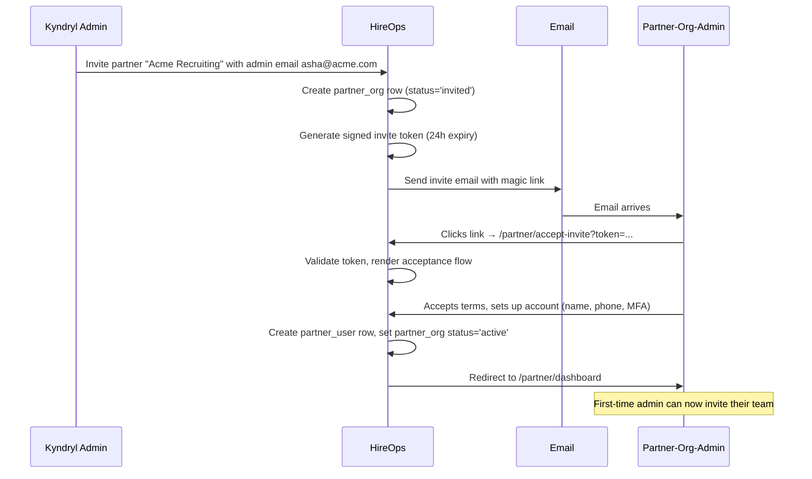
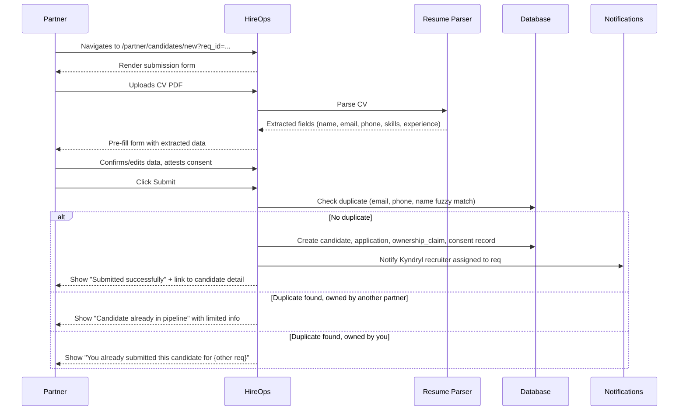
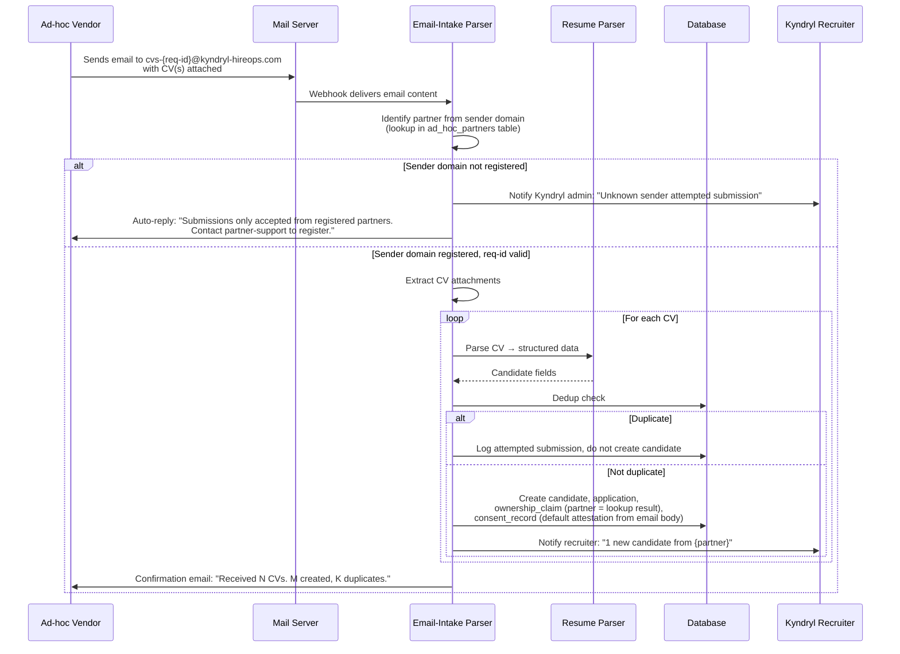

# HR Partner Portal — Wireflow Specification

**Status:** Draft v0.1
**Date:** 8 May 2026
**Audience:** Product designers, frontend engineers, backend engineers, Kyndryl review
**Companion to:** `requirements.md` Section 6, `architecture.md` Section 7
**Purpose:** Bridge the gap between requirements ("partners can submit candidates") and engineering ("here's what to build"). Captures every screen, every interaction, every edge case for the partner-facing surfaces — the empanelled portal and the ad-hoc email-intake flow.

---

## 1. How to read this document

This is a **wireflow document**, not wireframes. Wireframes are visual sketches a designer produces; wireflows are structured descriptions of every screen plus how screens connect. The advantage: every decision is captured in text that engineers can implement against and that survives the design redo (which will happen — a designer will redraw all of this prettier in Figma).

For each screen, you'll see:

- **Purpose** — one-line answer to "why does this screen exist"
- **Layout sketch** — ASCII representation of the screen structure
- **Data on screen** — every field, where it comes from, who can see it
- **Interactions** — every button, link, form, and what it does
- **Edge cases** — what happens when things go wrong or are unexpected
- **Permission notes** — who exactly can access this and under what conditions

For multi-step flows, you'll see a mermaid sequence diagram showing how screens connect over time.

Two partner-facing surfaces are covered:
1. **Empanelled Partner Portal** (Section 3) — the full web app for empanelled vendors
2. **Ad-hoc Partner Email-Intake** (Section 4) — the no-portal email flow

The Kyndryl admin views (panel management, dispute resolution, partner-detail tabs) are **deferred to a separate document** to keep this doc focused on what partners themselves see and do. Two specific Kyndryl admin touchpoints are mentioned in Section 5 because they are inseparable from the partner flows: the "invite partner" action that triggers the empanelled-portal flow, and the email-intake configuration that makes ad-hoc submission work. Anything beyond those two touchpoints is out of scope here.

---

## 2. Information architecture overview

```
EMPANELLED PARTNER PORTAL               AD-HOC EMAIL-INTAKE
/partner                                (no UI for partner — email only)
├── /login                              
├── /forgot-password                    Inbound mailbox pattern:
├── /accept-invite                      cvs-{req-id}@kyndryl-hireops.com
├── /dashboard                          
├── /reqs                               Backend flow:
│   ├── /reqs (list)                    1. Email arrives at mail server
│   └── /reqs/:id                       2. Webhook delivers to parser
├── /candidates                         3. Sender domain → ad-hoc partner lookup
│   ├── /candidates (list)              4. CV parsed → candidate created
│   ├── /candidates/new                 5. Confirmation auto-reply
│   ├── /candidates/bulk                
│   ├── /candidates/speculative         
│   └── /candidates/:id                 (Visibility into intake activity is
├── /pipeline                            via Kyndryl admin views — covered in
├── /messages                            a separate document)
│   └── /messages/:thread
├── /commercials
│   ├── /overview
│   ├── /invoices
│   └── /disputes
├── /team                               (partner-org admin only)
│   ├── /users
│   ├── /invite
│   └── /settings
└── /settings
    ├── /profile
    ├── /notifications
    └── /password
```

The two Kyndryl admin touchpoints that are necessary entry points to these flows — inviting a partner, and configuring email-intake for an ad-hoc partner — are described in Section 5 with just enough detail to make the partner flows complete. Everything else on the Kyndryl admin side (partner panel dashboard, dispute resolution, partner detail tabs, audit views) is deferred to a future doc.

---

## 3. Empanelled Partner Portal

### 3.1 First-time access flow

When a Kyndryl admin invites a partner organisation, the partner-org-admin gets an email with a magic link. This is the entry point for everything that follows.



#### Screen: Accept Invite

**URL:** `/partner/accept-invite?token={signed_token}`
**Permissions:** Anonymous, requires valid unexpired token
**Purpose:** First-touch account setup for a newly invited partner-org-admin

```
┌────────────────────────────────────────────────────────────────┐
│  HireOps for Kyndryl                                            │
│                                                                 │
│  ┌──────────────────────────────────────────────────────────┐ │
│  │                                                           │ │
│  │  Welcome to the Kyndryl partner portal                    │ │
│  │                                                           │ │
│  │  You've been invited by Kyndryl to access their hiring   │ │
│  │  partner portal as the administrator for:                 │ │
│  │                                                           │ │
│  │  Acme Recruiting Pvt Ltd                                  │ │
│  │  Invited by: priya.sharma@kyndryl.com                     │ │
│  │  Expires: in 23h 47m                                      │ │
│  │                                                           │ │
│  │  ─────────────────────────────────────────────────────    │ │
│  │                                                           │ │
│  │  Your details                                             │ │
│  │  Email: asha@acme.com  (cannot change)                    │ │
│  │  Full name: [_________________________________________]   │ │
│  │  Phone:     [+91 _____________________________________]   │ │
│  │                                                           │ │
│  │  ─────────────────────────────────────────────────────    │ │
│  │                                                           │ │
│  │  Set up multi-factor authentication                       │ │
│  │  ○ Authenticator app (recommended)                        │ │
│  │  ○ SMS to your phone                                      │ │
│  │                                                           │ │
│  │  ─────────────────────────────────────────────────────    │ │
│  │                                                           │ │
│  │  ☐ I have read and agree to the Partner Terms of Use     │ │
│  │  ☐ I confirm I am authorised to accept on behalf of       │ │
│  │     Acme Recruiting Pvt Ltd                               │ │
│  │  ☐ I understand all candidate data must have DPDPA-       │ │
│  │     compliant consent before submission                   │ │
│  │                                                           │ │
│  │              [ Accept and continue ]                      │ │
│  │                                                           │ │
│  │  Need help? Contact partner-support@kyndryl-hireops.com  │ │
│  └──────────────────────────────────────────────────────────┘ │
└────────────────────────────────────────────────────────────────┘
```

**Data on screen:**
- Partner org name (from `partner_orgs.name`)
- Inviting Kyndryl admin (from `partner_orgs.invited_by_user_id` → `profiles`)
- Invite expiry countdown (computed live from `partner_invitations.expires_at`)
- Email (read-only, from invitation token)
- Three checkbox attestations (all required)

**Interactions:**
- Form submit → POST to `/api/partner/accept-invite` with token + form data
- All three checkboxes must be ticked to enable submit
- MFA setup is mandatory (no skip)
- On successful submit: account created, MFA prompt for first-time setup, then redirect to `/partner/dashboard`

**Edge cases:**
- Token expired → show "Invitation expired" page with "request new invite" CTA
- Token already used → show "This invitation has been accepted" page with login link
- Email already exists in another partner-org → show error, contact support
- Validation failure → inline error messages, do not lose form data

#### Screen: Login

**URL:** `/partner/login`
**Permissions:** Anonymous
**Purpose:** Daily auth for established partner users

```
┌────────────────────────────────────────────────────────────────┐
│  HireOps for Kyndryl                                            │
│                                                                 │
│              ┌────────────────────────────────────┐            │
│              │                                     │            │
│              │  Partner sign in                    │            │
│              │                                     │            │
│              │  Email                              │            │
│              │  [_______________________________] │            │
│              │                                     │            │
│              │  ○ Sign in with magic link          │            │
│              │  ○ Sign in with password            │            │
│              │                                     │            │
│              │              [ Continue ]           │            │
│              │                                     │            │
│              │  Forgot password?                   │            │
│              │                                     │            │
│              └────────────────────────────────────┘            │
│                                                                 │
│  Are you a Kyndryl employee? Sign in here →                    │
│  Are you a candidate? Sign in here →                           │
└────────────────────────────────────────────────────────────────┘
```

**Interactions:**
- Magic link → POST `/api/partner/auth/magic-link`, email sent, success message shown
- Password → reveals password field, then on submit POST `/api/partner/auth/login`
- After auth → MFA challenge (always, no skip)
- After MFA → redirect to `/partner/dashboard` or originally-requested URL

**Edge cases:**
- 5 failed attempts → 15-min lockout with email to user
- Inactive account (90+ days no login) → "Account suspended, contact your admin"
- Org suspended → "Your organisation's access has been suspended. Contact partner-support@kyndryl-hireops.com"

### 3.2 Dashboard

**URL:** `/partner/dashboard`
**Permissions:** Any partner user
**Purpose:** At-a-glance view of what needs attention today

```
┌────────────────────────────────────────────────────────────────────┐
│  HireOps  [Reqs] [Candidates] [Pipeline] [Messages] [Commercials]  │
│                                          🔔 3   Asha P. ▾          │
├────────────────────────────────────────────────────────────────────┤
│                                                                     │
│  Good morning, Asha · Acme Recruiting · 8 May 2026                 │
│                                                                     │
│  ┌──────────────┐ ┌──────────────┐ ┌──────────────┐ ┌────────────┐│
│  │ Open reqs    │ │ My active    │ │ Pending      │ │ Hires this ││
│  │ for you      │ │ submissions  │ │ feedback     │ │ month      ││
│  │     12       │ │     47       │ │      3       │ │      2     ││
│  │ +2 new today │ │ 12 in interv │ │ 24h overdue  │ │ ₹4.8L fees ││
│  └──────────────┘ └──────────────┘ └──────────────┘ └────────────┘│
│                                                                     │
│  ─── Needs your attention ──────────────────────────────────────── │
│                                                                     │
│  • 2 new reqs opened to you yesterday                              │
│    Senior Java Developer (3 positions) — view                      │
│    DevOps Engineer (1 position) — view                             │
│                                                                     │
│  • 3 of your submissions are awaiting screen >5 days               │
│    Expected SLA: 3 working days                                    │
│    View overdue submissions →                                      │
│                                                                     │
│  • 1 candidate offer-stage — congratulations!                      │
│    Vikram Rao · Senior Cloud Architect · offer extended 6 May     │
│                                                                     │
│  ─── Recent activity ────────────────────────────────────────────  │
│                                                                     │
│  Today, 09:14 — Rohit M. (your team) submitted Anjali D. for      │
│                  Senior Java Developer                             │
│  Today, 08:30 — Priya S. (Kyndryl) shortlisted Karan B. for       │
│                  Tech Lead - Frontend                              │
│  Yesterday    — Vikram R. moved to offer stage                    │
│  Yesterday    — Senior DevOps role opened to you                  │
│                                                                     │
│                                            [ View all activity → ] │
└────────────────────────────────────────────────────────────────────┘
```

**Data on screen:**
- KPI tiles: counts from queries scoped to `partner_org_id = current_user.partner_org_id`
- "Needs attention" items: derived from rules engine (overdue submissions, new reqs, stage changes)
- Activity feed: last 10 events from `partner_activity_log` for this org

**Interactions:**
- Each tile clicks through to filtered list view
- "Needs attention" items are clickable, route to relevant screen
- Activity feed is scrollable, "View all" → `/partner/activity`

**Permission notes:**
- All numbers are scoped to `partner_org_id` — never include other partners' data
- Partner-org-admin sees aggregate; partner recruiter sees only their own submissions in "My active submissions"

**Edge cases:**
- New partner with no submissions yet → show getting-started cards instead of KPIs
- Partner with no open reqs assigned → "No reqs are currently open to you. Check back later or contact your Kyndryl point-of-contact."
- All KPIs are zero → tasteful empty state, not a wall of "0"

### 3.3 Open requisitions list

**URL:** `/partner/reqs`
**Permissions:** Any partner user
**Purpose:** See which reqs Kyndryl has opened to this partner organisation

```
┌────────────────────────────────────────────────────────────────────┐
│  Open requisitions assigned to Acme Recruiting                     │
│                                                                     │
│  Filters: [Function ▾] [Location ▾] [Urgency ▾] [Open since ▾]    │
│  Search:  [___________________________]    Sort: [Most recent ▾]  │
│                                                                     │
│  ┌──────────────────────────────────────────────────────────────┐ │
│  │ 🔥 URGENT  Senior Java Developer                              │ │
│  │ 3 positions · Bangalore · Opened 7 May (1 day ago)           │ │
│  │ Skills: Java 17, Spring Boot, AWS, Kafka                     │ │
│  │ Your submissions: 0    [View full req → ] [Submit candidate ]│ │
│  └──────────────────────────────────────────────────────────────┘ │
│                                                                     │
│  ┌──────────────────────────────────────────────────────────────┐ │
│  │     DevOps Engineer                                           │ │
│  │ 1 position · Pune · Opened 7 May (1 day ago)                 │ │
│  │ Skills: Kubernetes, Terraform, GCP, Python                   │ │
│  │ Your submissions: 0    [View full req → ] [Submit candidate ]│ │
│  └──────────────────────────────────────────────────────────────┘ │
│                                                                     │
│  ┌──────────────────────────────────────────────────────────────┐ │
│  │     Tech Lead - Frontend                                      │ │
│  │ 1 position · Bangalore · Opened 28 Apr (10 days ago)         │ │
│  │ Skills: React, TypeScript, Next.js, design systems           │ │
│  │ Your submissions: 4 (1 in interview, 3 in screen)            │ │
│  │                       [View full req → ] [Submit candidate ]│ │
│  └──────────────────────────────────────────────────────────────┘ │
│                                                                     │
│  Showing 12 of 12 reqs                                             │
└────────────────────────────────────────────────────────────────────┘
```

**Data on screen:**
- Reqs WHERE `partner_assignments.partner_org_id = current_user.partner_org_id` AND `requisitions.status = 'posted'`
- Urgency flag from `requisitions.urgency`
- Open-since computed from `requisitions.posted_at`
- "Your submissions" count from `applications` joined to this partner org via `submissions.partner_org_id`

**Interactions:**
- Filter chips update the URL query params, refetch
- Search hits the req title and skill tags
- "View full req" → req detail page
- "Submit candidate" → goes to `/partner/candidates/new?req_id=...` (pre-fills the req)

**Permission notes:**
- Partner sees ONLY reqs in `partner_assignments` for their org
- Partner does NOT see total candidate count for the req — only their own submissions count
- Partner does NOT see other partners' submissions count

**Edge cases:**
- No reqs assigned → empty state with helpful copy and link to "How to get more reqs assigned"
- Req closed/filled while partner is viewing → refresh shows it removed; soft toast: "1 req was closed since your last refresh"

### 3.4 Requisition detail

**URL:** `/partner/reqs/:req_id`
**Permissions:** Any partner user, only if their org is assigned to this req
**Purpose:** Full req description so partner can source effectively

```
┌────────────────────────────────────────────────────────────────────┐
│  ← Back to reqs                                                     │
│                                                                     │
│  Senior Java Developer                                             │
│  REQ-2026-0847 · 3 positions · Bangalore · 🔥 URGENT               │
│                                                                     │
│  [ Submit candidate against this req ]   [ Bulk submit (CSV) ]    │
│                                                                     │
│  ─── Role description ──────────────────────────────────────────── │
│                                                                     │
│  We're hiring 3 Senior Java Developers for our cloud platform     │
│  team in Bangalore. The team builds and operates a multi-tenant   │
│  SaaS platform serving 500K+ daily active users globally.         │
│                                                                     │
│  [Full JD displayed here, ~500 words]                              │
│                                                                     │
│  ─── Required skills ───────────────────────────────────────────── │
│                                                                     │
│  Must-have: Java 17, Spring Boot 3.x, REST APIs, AWS, Kafka       │
│  Good-to-have: Kubernetes, GraphQL, observability tooling         │
│                                                                     │
│  ─── Compensation band ─────────────────────────────────────────── │
│                                                                     │
│  ₹28-42 LPA depending on experience                                │
│                                                                     │
│  ─── Logistics ─────────────────────────────────────────────────── │
│                                                                     │
│  Experience: 6-10 years                                            │
│  Notice period: max 60 days (negotiable for outstanding profiles)  │
│  Work mode: Hybrid (3 days/week from Bangalore office)             │
│  Visa sponsorship: No                                              │
│                                                                     │
│  ─── Knockout questions ────────────────────────────────────────── │
│                                                                     │
│  Submitted candidates must clear:                                  │
│  · Currently working in India? (Y/N — Y required)                  │
│  · Notice period ≤ 60 days? (Y/N — Y required)                     │
│  · Years of Java experience ≥ 6? (Y/N — Y required)                │
│                                                                     │
│  ─── Your submissions for this req ─────────────────────────────── │
│                                                                     │
│  None yet. [ Submit your first candidate → ]                       │
└────────────────────────────────────────────────────────────────────┘
```

**Data on screen:**
- Full req from `requisitions` + linked `jd_versions`
- Skill list from `jd_skills`
- Knockout questions from `requisition_knockouts`
- Partner's own submissions for this req from `applications`

**Interactions:**
- "Submit candidate" → `/partner/candidates/new?req_id={req_id}`
- "Bulk submit" → `/partner/candidates/bulk?req_id={req_id}`

**Permission notes:**
- All knockouts visible (partner needs to know to filter their candidates)
- Compensation band visible (partner needs to know what to pitch)
- Internal hiring manager identity is NOT visible
- Other submission counts NOT visible

**Edge cases:**
- Req closed mid-view → banner: "This req has been closed. New submissions are no longer being accepted."
- Req filled while partner viewing → same as above

### 3.5 Submit a candidate (single)

**URL:** `/partner/candidates/new?req_id={req_id}` (req_id optional — if missing, becomes speculative submission)
**Permissions:** Any partner user
**Purpose:** The most-used screen in the partner portal — actually submitting a candidate



```
┌────────────────────────────────────────────────────────────────────┐
│  ← Back to req                                                      │
│                                                                     │
│  Submit candidate                                                  │
│  For: Senior Java Developer · REQ-2026-0847                        │
│                                                                     │
│  ┌───────────────────────────────────────────────────────────────┐ │
│  │  Step 1 of 3 — Upload CV                                      │ │
│  │                                                                │ │
│  │  ┌──────────────────────────────────────────────────────────┐│ │
│  │  │                                                            ││ │
│  │  │   📄 Drop CV here or click to upload                      ││ │
│  │  │   PDF or DOC, max 10MB                                    ││ │
│  │  │                                                            ││ │
│  │  └──────────────────────────────────────────────────────────┘│ │
│  └───────────────────────────────────────────────────────────────┘ │
└────────────────────────────────────────────────────────────────────┘

[After upload, parser runs, then:]

┌────────────────────────────────────────────────────────────────────┐
│  ┌───────────────────────────────────────────────────────────────┐ │
│  │  Step 2 of 3 — Confirm candidate details                       │ │
│  │  We extracted these from the CV. Edit if anything's wrong.     │ │
│  │                                                                │ │
│  │  Full name *      [Anjali Desai_________________________]     │ │
│  │  Email *          [anjali.desai@gmail.com_______________]     │ │
│  │  Phone *          [+91 98765 43210_____________________]      │ │
│  │  Current company  [Infosys Limited_____________________]      │ │
│  │  Current title    [Senior Software Engineer____________]      │ │
│  │  Total experience [7 years_____________________________]      │ │
│  │  Current CTC      [₹22 LPA____________________________]       │ │
│  │  Expected CTC     [₹35 LPA____________________________]       │ │
│  │  Notice period    [60 days____________________________]       │ │
│  │  Location         [Bangalore__________________________]       │ │
│  │                                                                │ │
│  │  Knockout questions (required)                                 │ │
│  │  · Currently working in India?         ☐ Yes  ☐ No            │ │
│  │  · Notice period ≤ 60 days?            ☐ Yes  ☐ No            │ │
│  │  · Years of Java experience ≥ 6?       ☐ Yes  ☐ No            │ │
│  │                                                                │ │
│  │  Your note to recruiter (optional, max 500 chars)             │ │
│  │  [_________________________________________________________]  │ │
│  │  [_________________________________________________________]  │ │
│  └───────────────────────────────────────────────────────────────┘ │
└────────────────────────────────────────────────────────────────────┘

[After confirming details:]

┌────────────────────────────────────────────────────────────────────┐
│  ┌───────────────────────────────────────────────────────────────┐ │
│  │  Step 3 of 3 — Consent attestation                             │ │
│  │                                                                │ │
│  │  Before submitting, please confirm:                            │ │
│  │                                                                │ │
│  │  ☐ I have obtained explicit, DPDPA-compliant consent from     │ │
│  │     Anjali Desai to share her CV and personal details with    │ │
│  │     Kyndryl for the purpose of evaluating her candidacy for   │ │
│  │     this role.                                                 │ │
│  │                                                                │ │
│  │  ☐ The candidate has been informed that her data may be       │ │
│  │     processed by Kyndryl, retained per their retention policy,│ │
│  │     and that she has rights of access, correction, and        │ │
│  │     erasure.                                                   │ │
│  │                                                                │ │
│  │  ☐ The information in this submission is accurate to the best │ │
│  │     of my knowledge. I understand that submitting falsified   │ │
│  │     information is grounds for partner termination.            │ │
│  │                                                                │ │
│  │  ─────────────────────────────────────────────────────────    │ │
│  │                                                                │ │
│  │  By submitting, you claim ownership of this candidate per    │ │
│  │  Kyndryl's MSA Section 4.2. The 90-day exclusivity window    │ │
│  │  starts now if this submission is accepted.                  │ │
│  │                                                                │ │
│  │              [ Cancel ]    [ Submit candidate ]               │ │
│  └───────────────────────────────────────────────────────────────┘ │
└────────────────────────────────────────────────────────────────────┘
```

**Data on screen:**
- CV upload triggers backend resume-parsing service (LLM-based, returns structured JSON)
- All fields pre-filled from parser; partner can edit
- Knockout questions pulled from `requisition_knockouts`
- Consent attestation text is configurable via admin (so legal can update without code change)

**Interactions:**
- Three-step wizard with progress indicator
- "Save as draft" available at any step (creates `partner_submission_draft`)
- Drafts auto-saved every 30s
- Submit triggers dedup check, ownership claim, consent record, notification cascade

**Edge cases:**
- **Resume parser fails** → fall back to manual entry, surface warning "We couldn't read this CV. Please enter details manually."
- **Knockout failure** → block submit, show "This candidate doesn't meet the knockout criteria for this role" with explanation
- **Duplicate detected (owned by another partner)** → show: "This candidate is already in our pipeline (submitted [N] days ago). Per our partner agreement, ownership belongs to the first valid submission. You may not submit them for this req. Contact partner-support if you believe this is in error."
- **Duplicate detected (owned by you, different req)** → show: "You already submitted this candidate for [other req name] on [date]. Your existing ownership window covers this submission too — would you like to add them to this req as well?"
- **Duplicate detected (you, this req)** → show: "You already submitted this candidate for this req on [date]. View their status here."
- **Speculative submission (no req_id)** → consent attestation includes additional clause about talent-pool retention

**Permission notes:**
- Submit creates `submissions` row with `partner_org_id` and `submitted_by_partner_user_id`
- Creates `candidate_ownership_claims` row with `claimed_at` set to NOW() (millisecond precision)
- Creates `consents` row tied to candidate, retained 7 years per DPDPA

### 3.6 Bulk submit candidates

**URL:** `/partner/candidates/bulk?req_id={req_id}`
**Permissions:** Any partner user
**Purpose:** Submit 5-50 candidates against the same req at once. Common during ramp.

```
┌────────────────────────────────────────────────────────────────────┐
│  Bulk submit candidates                                             │
│  For: Senior Java Developer · REQ-2026-0847                        │
│                                                                     │
│  ┌───────────────────────────────────────────────────────────────┐ │
│  │  Option 1: Drop ZIP of CVs                                     │ │
│  │                                                                │ │
│  │   📦  Drag and drop a ZIP file containing CVs (max 50)        │ │
│  │       We'll parse each CV and create a row for review         │ │
│  └───────────────────────────────────────────────────────────────┘ │
│                                                                     │
│  ┌───────────────────────────────────────────────────────────────┐ │
│  │  Option 2: Upload CSV with details + linked CVs                │ │
│  │                                                                │ │
│  │  Download template: [hireops-bulk-submit-template.csv]        │ │
│  │  CSV must include: name, email, phone, cv_filename            │ │
│  │  CV files must be in same folder, named per cv_filename       │ │
│  │                                                                │ │
│  │   📄  Upload CSV  +  ZIP of CVs                                │ │
│  └───────────────────────────────────────────────────────────────┘ │
└────────────────────────────────────────────────────────────────────┘

[After upload + parsing, review screen:]

┌────────────────────────────────────────────────────────────────────┐
│  Review 23 parsed candidates                                        │
│                                                                     │
│  ⚠ 2 candidates flagged — review before submitting                 │
│                                                                     │
│  Filters: [✓ All] [⚠ Issues only (2)] [✓ Ready (21)]               │
│                                                                     │
│  ┌──────────────────────────────────────────────────────────────┐ │
│  │ ☑  Anjali Desai · anjali.desai@gmail.com · +91 98... · 7y exp │ │
│  │    Java, Spring, AWS · Bangalore · ₹22→35 LPA · 60d notice    │ │
│  │    [View] [Edit]                                               │ │
│  │ ─────────────────────────────────────────────────────────────│ │
│  │ ⚠  Vikram Rao · vikram.rao@gmail.com · +91 99... · 8y exp    │ │
│  │    DUPLICATE: Already submitted by another partner on 3 May   │ │
│  │    Cannot include in this submission.                          │ │
│  │    [Remove from batch]                                         │ │
│  │ ─────────────────────────────────────────────────────────────│ │
│  │ ⚠  Karan Bhatia · karan@gmail.com · +91 95... · 5y exp        │ │
│  │    KNOCKOUT FAIL: Years of Java experience < 6                 │ │
│  │    [Remove from batch] [Override (with reason)]                │ │
│  │ ─────────────────────────────────────────────────────────────│ │
│  │ ☑  Priya Sharma · priya@gmail.com · +91 88... · 9y exp        │ │
│  │    [View] [Edit]                                               │ │
│  │ ...                                                            │ │
│  └──────────────────────────────────────────────────────────────┘ │
│                                                                     │
│  ☐ I attest consent for all 21 ready candidates                    │
│  ☐ All information accurate                                        │ │
│                                                                     │
│           [ Cancel ]  [ Submit 21 ready candidates ]               │ │
└────────────────────────────────────────────────────────────────────┘
```

**Edge cases:**
- ZIP without parseable CVs → reject with explanation
- Mix of duplicates and ready → user can submit only the ready ones
- Override on knockout fail → requires written reason, surfaced to recruiter for explicit accept/reject
- More than 50 CVs in batch → reject, ask to split

### 3.7 Pipeline view

**URL:** `/partner/pipeline`
**Permissions:** Any partner user
**Purpose:** Track all submissions across all reqs

```
┌────────────────────────────────────────────────────────────────────┐
│  Your candidate pipeline                                            │
│                                                                     │
│  Filters: [All reqs ▾] [Last 90d ▾] [All stages ▾] [All recruiters]│
│                                                                     │
│  ┌────┬───────────┬──────────┬──────────┬───────┬──────────┬─────┐ │
│  │    │ Submitted │ Screened │ Interview│ Offer │ Hired    │ Rej │ │
│  │    │    18     │    12    │     8    │   3   │     2    │  4  │ │
│  ├────┼───────────┼──────────┼──────────┼───────┼──────────┼─────┤ │
│  │    │           │          │          │       │          │     │ │
│  │    │ A. Desai  │ R. Singh │ K. Bhatia│V. Rao │ M. Patel │ ... │ │
│  │    │ Java SDE  │ DevOps   │ Frontend │Cloud  │ Data Eng │     │ │
│  │    │ Submitted │ Screened │ R2: 9 May│Offer  │ Joined 1 │     │ │
│  │    │ 7 May     │ 5 May    │          │ext 6  │ May      │     │ │
│  │    │           │          │          │ May   │          │     │ │
│  │    │ ─────     │ ─────    │ ─────    │ ───── │ ─────    │     │ │
│  │    │ N. Mehta  │ S. Iyer  │ ...      │       │ ...      │     │ │
│  │    │ Java SDE  │ DevOps   │          │       │          │     │ │
│  │    │ Submitted │ Screened │          │       │          │     │ │
│  │    │ 7 May     │ 4 May    │          │       │          │     │ │
│  │    │ ─────     │          │          │       │          │     │ │
│  │    │ ...       │          │          │       │          │     │ │
│  └────┴───────────┴──────────┴──────────┴───────┴──────────┴─────┘ │
│                                                                     │
│  Click any candidate for full status                                │
└────────────────────────────────────────────────────────────────────┘
```

**Data on screen:**
- Kanban-style by stage
- Only candidates from `submissions` WHERE `partner_org_id = current_user.partner_org_id`
- Stages from canonical state machine in `requirements.md` Section 4
- Each card shows: candidate name, role, current stage with date

**Permission notes:**
- Partner sees stage and date, NOT the reasons or feedback
- Partner sees the candidate's name and the role, NOT internal scoring or comments
- Rejected: shown but reason text is not — only "Rejected: see partner-support if you'd like a debrief"

**Edge cases:**
- 100+ candidates → virtualised scrolling per column
- Candidate hired → green confirmation, fee tracking now visible in `/partner/commercials`
- Candidate ghosted → after 14 days no movement, surfaced with "Status unclear — contact recruiter" CTA

### 3.8 Candidate detail (partner view)

**URL:** `/partner/candidates/:candidate_id`
**Permissions:** Partner user, only if candidate was submitted by their org
**Purpose:** See full status of a single candidate

```
┌────────────────────────────────────────────────────────────────────┐
│  ← Back to pipeline                                                 │
│                                                                     │
│  Anjali Desai                                                      │
│  Submitted by you (Acme Recruiting) on 7 May 2026                  │
│                                                                     │
│  Current stage: 🟡 Screening                                       │
│  Submitted to: Senior Java Developer · REQ-2026-0847               │
│                                                                     │
│  Ownership: ⚖ You own this candidate until 5 Aug 2026 (90d window)│
│  Fee on hire: ₹2.8L (per your MSA Schedule A)                      │
│                                                                     │
│  ─── Timeline ─────────────────────────────────────────────────── │
│                                                                     │
│  7 May 09:14    You submitted Anjali for Senior Java Developer    │
│  7 May 11:30    Submission accepted by Priya S. (Kyndryl)         │
│  8 May 14:00    Screening in progress                              │
│  --             Awaiting tech interview                            │
│  --             Awaiting HR round                                  │
│  --             Awaiting offer                                     │
│                                                                     │
│  ─── Candidate details ───────────────────────────────────────── │
│                                                                     │
│  [Editable view of submitted details — note: cannot edit after    │
│   submission, only view what was submitted]                        │
│                                                                     │
│  ─── Communication ──────────────────────────────────────────── │
│                                                                     │
│  ┌──────────────────────────────────────────────────────────────┐│
│  │ You can message Anjali directly via the platform.            ││
│  │ All messages are logged. Do not share offers, comp details,  ││
│  │ or attempt to redirect to other roles outside HireOps.       ││
│  │                                                                ││
│  │ [ Open conversation with Anjali → ]                          ││
│  └──────────────────────────────────────────────────────────────┘│
│                                                                     │
│  ─── Documents ───────────────────────────────────────────────── │
│                                                                     │
│  📄 anjali_desai_cv.pdf  (your submitted CV)  [Download]          │
│  📄 consent_record.pdf   (DPDPA attestation)  [Download]          │
└────────────────────────────────────────────────────────────────────┘
```

**Data on screen:**
- Stage from canonical state machine
- Timeline from `audit_logs` filtered to events the partner can see
- Ownership lock from `candidate_ownership_claims`
- Fee from MSA-driven `partner_contracts.fee_schedule`

**Permission notes:**
- Partner sees stage transitions, NOT internal feedback
- Partner sees own submission and consent record
- Partner does NOT see scoring rationale, panellist names, internal comments, or other partners' attempts

**Edge cases:**
- Candidate accepts offer → "Communication closed: Anjali has accepted the offer. Per partner terms, you may not contact her after this point." Banner explaining anti-poaching policy.
- Candidate hired → fee now visible in `/partner/commercials/invoices` as eligible for invoicing
- Candidate rejected → final stage shown, "Outcome: Not selected. Contact partner-support if you'd like a debrief." (no internal feedback)
- Ownership window expires while candidate still in pipeline → banner: "Your 90-day ownership window has expired. If this candidate is hired now, fee attribution is per MSA Section 4.7."

### 3.9 Speculative submissions (talent pool)

**URL:** `/partner/candidates/speculative`
**Permissions:** Any partner user
**Purpose:** Submit candidates without a specific req — for the talent pool

Layout is similar to single-candidate submit but without the req-specific fields. Adds skill tagging.

```
┌────────────────────────────────────────────────────────────────────┐
│  Submit to talent pool (no specific req)                           │
│                                                                     │
│  Use this when you have a strong candidate but Kyndryl doesn't    │
│  have a matching open req right now. Kyndryl recruiters search   │
│  the talent pool when new reqs open.                              │
│                                                                     │
│  ⚠ Important: Talent pool submissions require explicit candidate  │
│  consent for retention up to 24 months. The candidate must agree │
│  to being held in pool.                                            │
│                                                                     │
│  [ Standard upload + parse + confirm flow as Section 3.5 ]        │
│                                                                     │
│  ─── Skill profile (for matching) ─────────────────────────────── │
│                                                                     │
│  Primary skills (3-7 required):                                    │
│  [+ Add skill]                                                     │
│  · Java 17                                                         │
│  · Spring Boot                                                     │
│  · AWS                                                             │
│  · Microservices                                                   │
│                                                                     │
│  Role family: [Senior Software Engineer ▾]                         │
│  Function: [Engineering ▾]                                         │
│  Preferred location: [Bangalore, Pune, Remote-India ▾]             │
│  Earliest available: [Date picker]                                 │
│                                                                     │
│  ─── Talent pool consent (extra) ─────────────────────────────── │
│                                                                     │
│  ☐ Candidate has consented to being held in Kyndryl's talent      │
│    pool for up to 24 months and being contacted about future     │
│    matching roles.                                                 │
│                                                                     │
│  ☐ Candidate understands they can withdraw consent at any time   │
│    via candidate portal.                                           │
│                                                                     │
│              [ Submit to talent pool ]                             │
└────────────────────────────────────────────────────────────────────┘
```

**Permission notes:**
- Different ownership rules: speculative submissions have a 180-day window (vs 90 for req-bound)
- Consent record explicitly tagged as `consent_purpose='talent_pool'` for retention compliance

### 3.10 Messaging with candidates

**URL:** `/partner/messages` and `/partner/messages/:thread_id`
**Permissions:** Partner user, only for candidates they submitted
**Purpose:** Direct partner-to-own-candidate communication

```
┌────────────────────────────────────────────────────────────────────┐
│  Messages                                                           │
│                                                                     │
│  ┌────────────────────────┬──────────────────────────────────────┐│
│  │ Conversations           │ Anjali Desai                         ││
│  │                         │ Senior Java Developer · Submitted 7d ││
│  │ ✉ Anjali Desai (3)      │                                      ││
│  │ ✉ Karan Bhatia          │ ──────────────────────────────────── ││
│  │ ✉ Priya Sharma           │                                      ││
│  │ ...                     │ Yesterday 14:00                      ││
│  │                         │ Hi Anjali, just confirming you got   ││
│  │                         │ the interview invite for Friday at   ││
│  │                         │ 11am? Let me know if you have any    ││
│  │                         │ questions.                            ││
│  │                         │                  — Asha (Acme)        ││
│  │                         │                                      ││
│  │                         │ Yesterday 16:23                      ││
│  │                         │ Yes confirmed, thanks Asha! Quick    ││
│  │                         │ question on the role - is the team   ││
│  │                         │ working on greenfield or maintenance?││
│  │                         │                          — Anjali    ││
│  │                         │                                      ││
│  │                         │ Today 09:14                          ││
│  │                         │ Mostly greenfield - new platform     ││
│  │                         │ being built. They'll cover that in   ││
│  │                         │ the interview too. Best of luck!     ││
│  │                         │                  — Asha (Acme)        ││
│  │                         │                                      ││
│  │                         │ ⚠ Reminder: messages are logged and  ││
│  │                         │ may be reviewed by Kyndryl HR. Do    ││
│  │                         │ not discuss compensation, attempt to ││
│  │                         │ recruit for other roles, or share    ││
│  │                         │ confidential information.            ││
│  │                         │                                      ││
│  │                         │ ┌────────────────────────────────┐  ││
│  │                         │ │ Type a message...              │  ││
│  │                         │ │                                │  ││
│  │                         │ └────────────────────────────────┘  ││
│  │                         │                  [Send]              ││
│  └────────────────────────┴──────────────────────────────────────┘│
└────────────────────────────────────────────────────────────────────┘
```

**Edge cases:**
- After offer-accept → conversation locked, banner: "This candidate has accepted an offer. Communication is closed."
- LLM monitor flags problematic content → message held for review, partner notified, Kyndryl HR alerted
- Repeated violations → partner organisation flagged for Kyndryl admin review

**Permission notes:**
- Every message logged in `partner_candidate_messages` with full content
- LLM monitor runs on every outgoing message before delivery
- Kyndryl admins can read all messages in audit view (partners are told this in the consent flow)

### 3.11 Commercials & invoices

**URL:** `/partner/commercials` (partner-org-admin only)
**Permissions:** Partner-org-admin role
**Purpose:** Track placement fees, invoices, payments

```
┌────────────────────────────────────────────────────────────────────┐
│  Commercials & invoices                                             │
│  Acme Recruiting · MSA effective 1 Jan 2026                        │
│                                                                     │
│  ┌──────────────┐ ┌──────────────┐ ┌──────────────┐ ┌────────────┐│
│  │ This month   │ │ Year to date │ │ Pending      │ │ Disputed   ││
│  │              │ │              │ │ invoices     │ │            ││
│  │   ₹4.8L      │ │   ₹38.4L     │ │   ₹6.2L      │ │   ₹1.4L    ││
│  │ 2 hires      │ │ 16 hires     │ │ 3 invoices   │ │ 1 dispute  ││
│  └──────────────┘ └──────────────┘ └──────────────┘ └────────────┘│
│                                                                     │
│  ─── Fee-eligible hires (16) ─────────────────────────────────────│
│                                                                     │
│  Tabs: [Eligible (3)] [Invoiced (10)] [Paid (3)] [Disputed (1)]   │
│                                                                     │
│  ┌──────────────────────────────────────────────────────────────┐│
│  │ Mira Patel · Data Engineer · Joined 1 May 2026               ││
│  │ Ownership: confirmed · MSA fee: 12% · ₹2.4L                  ││
│  │ Probation passes: 1 Aug 2026 (holdback released then)        ││
│  │                              [ Generate invoice ]              ││
│  ├──────────────────────────────────────────────────────────────┤│
│  │ Vikram Rao · Cloud Architect · Joined 28 Apr 2026            ││
│  │ Ownership: confirmed · MSA fee: 15% · ₹3.6L                  ││
│  │ Probation passes: 28 Jul 2026 (holdback released then)       ││
│  │                              [ Generate invoice ]              ││
│  ├──────────────────────────────────────────────────────────────┤│
│  │ Anjali D. · SDE · Joined 15 Apr 2026                         ││
│  │ Ownership: confirmed · MSA fee: 10% · ₹2.2L                  ││
│  │ Probation passes: 15 Jul 2026                                ││
│  │                              [ Generate invoice ]              ││
│  └──────────────────────────────────────────────────────────────┘│
│                                                                     │
│  [ Download all as Excel ]                                         │
└────────────────────────────────────────────────────────────────────┘
```

**Data on screen:**
- Fees from `placement_fees` joined to MSA `partner_contracts.fee_schedule`
- KPI tiles aggregated from `placement_fees` + `partner_invoices` + `payments`
- Invoice states: eligible → invoiced → paid (or disputed)

**Interactions:**
- "Generate invoice" → produces PDF using template, marks fee as `invoiced`, notifies Kyndryl AP
- Click invoice → detail view with payment status
- Disputes → routes to dispute-resolution view (covered in the separate Kyndryl admin spec)

**Edge cases:**
- Hire leaves before probation completion → fee clawback flow (see MSA terms)
- MSA renewal pending → banner with renewal date and contract status
- Holdback released → automatic notification to partner

### 3.12 Team management (partner-org-admin)

**URL:** `/partner/team`
**Permissions:** Partner-org-admin only
**Purpose:** Manage which recruiters in the partner org have portal access

Standard user-management pattern: list of users in your org, invite new user, change role (admin / recruiter), suspend, remove. Audit trail of who did what when. Nothing exotic — standard SaaS team management UX.

---

## 4. Ad-hoc Partner Email-Intake

Ad-hoc partners do not get portal logins. They email CVs to a Kyndryl-managed mailbox. The platform parses these emails and creates candidate records with proper attribution.

### 4.1 The email-intake flow



### 4.2 Email format & conventions

**Inbound mailbox pattern:** `cvs-{req-id}@kyndryl-hireops.com`

Examples:
- `cvs-REQ-2026-0847@kyndryl-hireops.com` — CV submission against specific req
- `cvs-talent-pool@kyndryl-hireops.com` — speculative submission

**Required email content:**
- CV(s) as PDF or DOC attachment(s) — max 10 per email
- Sender must be from a registered partner domain (registered in `ad_hoc_partners`)
- Body should include consent attestation (parser looks for keywords like "consent obtained", "DPDPA compliant"); if absent, parser uses default attestation from partner registration

**Auto-reply to vendor:**

```
Subject: HireOps received your submission for REQ-2026-0847

Hi,

We received your email at 8 May 2026 09:14 IST and processed the following:

✓ Anjali Desai (anjali.desai@gmail.com) — created in pipeline
✓ Vikram Rao (vikram.rao@gmail.com) — created in pipeline
⚠ Karan Bhatia (karan@gmail.com) — already in pipeline (duplicate)
✗ priya_resume.pdf — could not parse, please resubmit with clearer text

Total: 3 valid CVs received, 2 created, 1 duplicate, 1 unparseable

Your submissions will be reviewed by Kyndryl recruiters. We'll notify
you of progress to: rohit@xyzpartners.com

If you'd like portal access for richer pipeline visibility,
contact partner-support@kyndryl-hireops.com to discuss empanelment.

— HireOps for Kyndryl
```

### 4.3 Edge cases for email intake

| Scenario | Handling |
|---|---|
| Sender domain not registered | Auto-reply with registration link, log in `intake_attempts` table for Kyndryl admin review |
| Email to invalid req-id | Auto-reply: "Req {id} not found. Please check the req-id." |
| Email to closed req | Auto-reply: "Req {id} is closed. Submissions no longer accepted." |
| Multiple emails from same vendor in 1 day | Throttle: max 50 CVs/day per vendor without admin approval |
| Vendor uses BCC to multiple companies | Detected by header analysis; flag for admin review (partners shouldn't be shopping CVs) |
| Email contains no CV attachments | Auto-reply: "No CV attachments found." |
| CV is a scanned image (no text) | Try OCR; if still unparseable, reject with reason |
| Vendor explicitly refuses consent attestation | CV not processed, vendor told why |
| Email from a domain belonging to an empanelled partner | Auto-reply: "Your organisation has full portal access. Please use the partner portal at partner.kyndryl-hireops.com instead of email." Email-intake is only for ad-hoc. |

---

## 5. Kyndryl admin touchpoints (in scope only because partner flows depend on them)

This section is deliberately narrow. It covers **only** the two Kyndryl-side actions that are necessary entry points to the partner flows: inviting a new partner organisation (which triggers everything in Section 3), and configuring email-intake (which makes Section 4 work at all). The broader Kyndryl admin surface for managing partners — panel dashboards, dispute resolution, partner detail tabs, audit views, commercials review — is **out of scope for this document** and will live in a separate Kyndryl admin spec.

### 5.1 Invite new partner

**URL:** `/app/admin/partners/new`
**Permissions:** Kyndryl `admin` role
**Purpose:** The single action that triggers the whole empanelled-partner flow. Without this, Section 3 has no entry point.

Two variants of the form, selected by the admin upfront:

**Empanelled invite:**
- Partner organisation name
- Admin email (the partner-org-admin who receives the invite)
- MSA PDF upload (stored, retained, referenced in commercials)
- Fee schedule selection (from pre-configured schedules: A / B / C / custom)
- Region tags (which Kyndryl GCC locations this partner can source for)
- Function tags (Engineering, Data, Cloud Infra, etc. — drives default req assignment)
- Replacement guarantee (default 90-day, overridable)
- Holdback percentage (default 25%, overridable)
- MSA expiry date

On submit:
- Creates `partner_orgs` row with `tier='empanelled'`, `status='invited'`
- Creates `partner_invitations` row with signed token, 24h expiry
- Sends invite email to admin email address
- Logs the action in audit

**Ad-hoc registration:**
- Partner organisation name (lighter-touch, no MSA required)
- Sender email domain(s) — comma-separated list of domains the parser will accept submissions from
- Default fee terms (per-hire flat fee or percentage)
- Daily submission quota (default 50 CVs/day)
- Default consent attestation text (used when partner emails don't include one)
- Default contact email for confirmation auto-replies

On submit:
- Creates `ad_hoc_partners` row with registered domains
- No portal access provisioned, no invite sent
- Domain list now active in email-intake parser
- Optional welcome email to the contact address explaining how email-intake works

**Edge cases:**
- Email already invited / domain already registered → block with clear error
- MSA upload fails → form remains, partner can retry without losing other data
- Empanelled invite to a previously-suspended partner → require explicit confirmation
- Ad-hoc registration of a domain that already belongs to an empanelled partner → block (one tier per partner)

### 5.2 Email-intake configuration

**URL:** `/app/admin/partners/intake`
**Permissions:** Kyndryl `admin` role
**Purpose:** The settings that govern how the ad-hoc email-intake flow described in Section 4 actually behaves. Without this, the parser has no rules to apply.

What's configurable:

| Setting | Description | Default |
|---|---|---|
| Inbound mailbox base | Domain for auto-generated mailbox aliases | `cvs-{req-id}@kyndryl-hireops.com` |
| Talent-pool mailbox | Address for speculative ad-hoc submissions | `cvs-talent-pool@kyndryl-hireops.com` |
| Auto-reply template | Confirmation email sent back to vendor | Section 4.2 default |
| Default consent attestation | Used when email body does not include consent language | Configurable text |
| Parser confidence threshold | Below this, CV goes to manual review queue instead of pipeline | 0.7 |
| Daily quota override | Per-partner override of the default 50 CVs/day | Per-partner row in `ad_hoc_partners.daily_quota` |
| BCC / multi-recipient detection | Whether to flag emails sent to multiple recipients | On |
| Unknown-sender handling | What happens when a registration email arrives from an unregistered domain | "Auto-reply with registration link, log for admin review" |

What it shows:
- Last 100 intake events (sender, timestamp, status, candidate created, error if any)
- Active mailbox aliases per req
- Per-partner intake stats (submissions today, this week, this month)
- Parser failure log (CVs that couldn't be parsed)

**Edge cases:**
- Mailbox alias collision → admin warned before save
- Disabling parser confidence threshold → admin warned that all CVs go to manual review
- Removing a registered domain → existing in-flight candidates retained, future submissions from that domain rejected with explanation

---

## 6. Cross-cutting concerns

### 6.1 Notification rules

| Event | Notify Partner | Notify Kyndryl |
|---|---|---|
| Partner submits candidate | Confirmation to submitter | Recruiter assigned to req |
| Submission accepted by recruiter | Submitter | — |
| Submission rejected (knockout fail) | Submitter | — |
| Candidate moves stage | Submitter (digest, daily) | — |
| Candidate offer extended | Submitter, partner-org-admin | Recruiter |
| Candidate hire confirmed | Submitter, partner-org-admin (with fee details) | Recruiter, People Ops |
| Candidate joins | Partner-org-admin (fee eligible from this point) | People Ops |
| Probation passes (holdback released) | Partner-org-admin (invoice now eligible for full amount) | Finance |
| Candidate leaves before probation | Partner-org-admin (clawback activated) | Finance |
| Ownership window expires | Partner-org-admin (digest, weekly) | — |
| Dispute opened against partner | Partner-org-admin | Partner manager |
| Quality score drops below threshold | Partner-org-admin (warning) | Partner manager |
| New req opened to partner | Partner-org-admin (digest, daily) | — |

### 6.2 Mobile responsiveness

The partner portal must be mobile-responsive — partners often submit candidates on the move (between candidate meetings, from cafes, etc.). Specific mobile considerations:

- Submit candidate flow: works on mobile, file upload from camera roll or files app
- Pipeline view: simplifies to single-column on mobile
- Messaging: native mobile-first design
- Dashboard: KPI tiles stack, activity feed remains
- Bulk submit, commercials, team management: desktop-only acceptable for v1

### 6.3 Internationalisation

POC: English only acceptable.
Phase 2: Hindi for India partners (most partners can read English fine, but the candidate-facing consent text should be available in Hindi/Tagalog as appropriate to where their candidates are).

### 6.4 Accessibility

Partner portal must meet WCAG 2.1 AA:
- Keyboard nav across all flows
- Screen-reader labels on all form controls
- Sufficient colour contrast (4.5:1 minimum for text)
- Focus indicators visible
- Bulk operations keyboard-accessible

### 6.5 Performance

- Dashboard P95 < 1.5s
- Submission flow form interactions P95 < 200ms
- Bulk submission of 50 candidates P95 < 30s end-to-end
- Pipeline view with 200 candidates P95 < 2s

### 6.6 Security touchpoints (cross-ref to architecture.md Section 7)

- All partner endpoints behind separate API gateway with stricter rate limits
- All partner queries pass through tenant-scoping RLS policies
- All partner downloads watermarked with partner org name + timestamp
- All partner uploads scanned for malware
- All partner messages content-monitored before delivery
- All partner sessions audit-logged for 7 years

---

## 7. What this document does not cover

- **Pixel-perfect designs** — a designer will produce real Figma screens. This is the input to that work.
- **Component specifications** — buttons, form controls, modals follow the broader HireOps design system (separate doc, follows after Wave 1)
- **Visual design** — colours, typography, illustrations, micro-interactions
- **Backend implementation** — see `architecture.md` Section 7 for data model and APIs
- **Migration of existing partner relationships** — if Kyndryl has 30 partners already submitting CVs via email or other ATS, the migration plan is its own doc

## 8. Open questions to resolve before build

1. **Partner-org-admin role granularity** — should partner-org-admin have ability to override their own recruiters' submissions? (current design: no)
2. **Speculative submission ownership window** — proposed 180 days. Confirm with Kyndryl legal.
3. **Bulk submit quota** — proposed 50/email for ad-hoc, 50/upload for portal. Acceptable?
4. **Replacement guarantee mechanics** — when a hire leaves in 90 days, does the partner get a free replacement attempt or just clawback? Both? Per-MSA?
5. **Talent pool re-prompt** — at 24-month consent expiry, does the system auto-prompt the candidate or partner? (proposed: candidate, with partner cc'd)
6. **Mobile partner portal** — full feature parity at launch, or web-only with mobile-responsive? (proposed: mobile-responsive web for POC)
7. **Multi-language consent text** — must be available in candidate's language at attestation time (English + Hindi for India POC?)
8. **Partner-side webhooks** — partners may want HireOps to push events to their internal CRMs. Phase 2 capability or POC scope?

---

## 9. Decision log

| Date | Decision | Rationale |
|---|---|---|
| 2026-05-08 | Two partner-facing surfaces in scope for this doc: empanelled portal and ad-hoc email-intake. Kyndryl admin views deferred to separate spec | Keeps this doc focused on what partners see and do. The two admin touchpoints needed to make these flows work end-to-end (invite partner, configure email-intake) are included in Section 5; everything else admin-side is out of scope here |
| 2026-05-08 | Magic link as default auth, password optional | Lower friction, fewer credential-related support tickets, MFA still mandatory |
| 2026-05-08 | Three-step submit wizard (CV → details → consent) | Mirrors how recruiters mentally process submissions; consent is foregrounded |
| 2026-05-08 | Bulk submit max 50 per batch | Enough for ramp-day flows, low enough to keep parser load manageable |
| 2026-05-08 | Speculative submissions get separate 180-day window | Industry norm; recognises that speculative candidates take longer to match |
