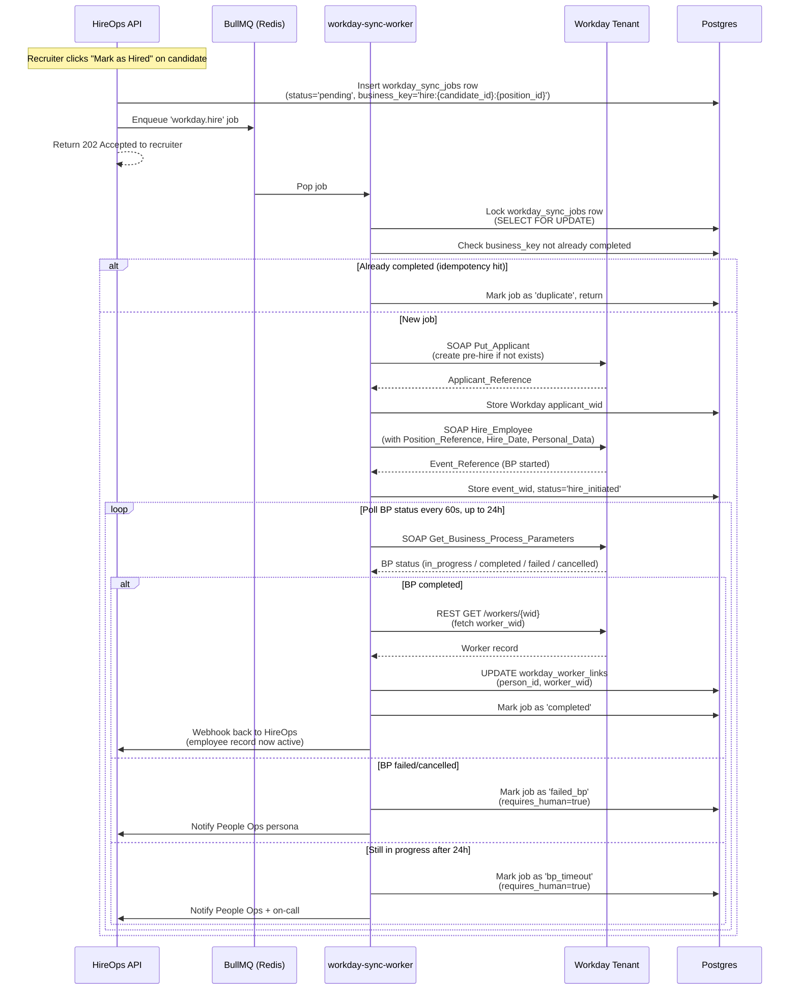

# ADR-001: Workday Integration Architecture

**Status:** Proposed (awaiting Kyndryl + engineering review)
**Date:** 8 May 2026
**Author:** HireOps Engineering
**Decision drivers:** Engineering Lead, Workday Integration Specialist
**Stakeholders:** Kyndryl HRIS Lead, Kyndryl GCC TA Lead, HireOps Product
**Supersedes:** None
**Related:** `requirements.md` Section 9.1, `architecture.md` Section 6

---

## 1. Context

HireOps is the ATS for Kyndryl GCC POC (300 hires/month). Workday is the HRIS-of-record. At the moment a candidate accepts an offer, we must create a Worker in Workday cleanly, idempotently, and reliably — and then keep that Worker in sync through their employment until termination.

We also need to read from Workday: org structure, positions, job profiles, and existing worker records (for the manager hierarchy, cost centres, locations, and approval chains).

This ADR locks the integration architecture. Without this decision in place, no other engineering work on the Workday boundary can start.

The decision must account for several non-obvious Workday realities that surfaced during the analysis:

1. **Workday does not natively support outbound webhooks** for HR data changes. This is a fundamental constraint — every "real-time" pattern from Workday to HireOps is actually polling. Vendors like Knit and Merge offer "virtual webhooks" by polling on your behalf, but the underlying mechanism is the same.
2. **Hire and Terminate are Workday Business Processes, not CRUD operations.** If the tenant has configured approval steps in the Hire BP, the API call *initiates* the process — it does not complete it. The Worker is not active until all approval steps clear, which may require human action.
3. **REST API parity with SOAP is partial.** Staffing operations (Hire, Terminate, Change Job, Change Position) remain SOAP-first as of WWS v46.1. REST is mature for reads and growing for some writes, but the canonical hire/terminate path is SOAP.
4. **OAuth 2.0 Client Credentials for REST does not issue refresh tokens.** Tokens expire in ~3600 seconds and must be re-fetched explicitly. This affects all retry and long-running job logic.
5. **Terminate_Employee does not revoke Workday UI login by itself.** A separate `Maintain_User_Account` call with `Account_Disabled=true` is required.

These are the kind of constraints that an architecture doc skipping detail would miss, and that an engineering team would discover painfully in week 6.

## 2. Decision

We will build a **direct, custom Workday integration** using:

- **SOAP** (WWS v43.x or later, targeting v46.x where stable) for all staffing transactions: `Hire_Employee`, `Terminate_Employee`, `Change_Job`, `Edit_Position_Restrictions`, `Maintain_User_Account`, `Put_Applicant`.
- **REST + WQL** (Workday Query Language) for all read operations: org structure, positions, job profiles, worker lookups, business-process status polling.
- **Authentication:** ISU (Integration System User) with WS-Security headers for SOAP; OAuth 2.0 Client Credentials for REST. Separate ISU and OAuth client per environment (sandbox / staging / production).
- **Architecture:** A dedicated Node.js worker process (`workday-sync-worker`), running independently of the main API, fed by BullMQ queues backed by Redis. **Not Supabase Edge Functions.**
- **Idempotency:** Every sync job carries a deterministic business key. Every Workday call is wrapped in an idempotency check against `workday_sync_jobs`.
- **Observability:** Every sync job logs to Datadog with structured fields; every failure pages on-call after retry exhaustion; every state divergence is surfaced in a daily reconciliation job.

We will **not** use Workato, Mulesoft, Boomi, or other middleware platforms for the POC.
We will **not** rely on Workday native webhooks (they don't exist).
We will **not** use SOAP for read operations where REST + WQL is sufficient.

## 3. Options considered

### Option A: Direct integration (SOAP + REST hybrid) — **CHOSEN**

Build our own SOAP client and REST client. Run them in a worker tier. Manage auth, retry, idempotency, reconciliation in our code.

| Pros | Cons |
|---|---|
| Full control over retry, idempotency, error handling | We own the maintenance burden (Workday releases twice a year, sometimes breaking things) |
| No third-party data flow — sensitive PII never leaves our perimeter | Higher initial engineering cost (~4-6 weeks vs ~2-3 for middleware) |
| Lower run-cost (no $50-80k/yr middleware licence) | Requires in-house Workday expertise (one specialist, possibly contracted) |
| Same code path for sandbox/staging/production with config swap | We have to handle Workday API quirks ourselves (BP status polling, account disable, etc.) |
| Fits cleanly into our worker / queue architecture | If the spec changes mid-build, rework is on us |

### Option B: REST-only

Use Workday's REST API exclusively, working around the gaps in REST coverage with creative WQL queries and accepting that some operations (Hire, Terminate) may require workarounds or aren't supported.

| Pros | Cons |
|---|---|
| Modern API, JSON, easier to debug | **REST does not currently support `Hire_Employee` end-to-end.** We'd have to use SOAP for the actual hire, which defeats the purpose |
| OAuth 2.0 only, no WS-Security complexity | We'd lose access to the rich Business Process model |
| Better tooling (Postman, Insomnia, etc.) | Some staffing operations have no REST equivalent |
| | **Rejected: it's not actually feasible for our use case.** |

### Option C: Middleware (Workato / Mulesoft / Boomi)

Use a Workday-approved iPaaS to handle the integration layer. We talk to the middleware, the middleware talks to Workday.

| Pros | Cons |
|---|---|
| Pre-built Workday connectors, certified | $50-80k/yr licence cost minimum |
| Faster initial integration (~2-3 weeks) | Slower iteration loop — every transform change is a JIRA to the middleware team |
| Visual flow builder that ops people can sometimes maintain | Adds a vendor relationship Kyndryl may want to negotiate independently |
| Built-in monitoring & error replay | PII flows through a third-party — additional DPDPA scope |
| | Locks us out of complex transformations we'll need (custom dedup, ownership-claim semantics, etc.) |
| | If middleware is down, we're down |

**Why we rejected this:** The middleware's "ease of use" assumes vanilla integrations. Our use case (custom dedup, partner attribution, candidate-to-Worker mapping with ownership semantics, DPDPA-aware retention) goes well beyond what middleware accelerates. We'd end up writing custom code anyway, but with an extra hop in the middle. For a POC where time-to-correctness matters more than time-to-first-call, direct wins.

We may revisit this in production if integration burden becomes unsustainable. Migration from direct to Workato is a refactor, not a rewrite.

### Option D: Workday EIB (Enterprise Interface Builder) for batched flows

Use EIB for flows that don't need real-time — push a daily CSV of new hires into Workday rather than firing per-hire SOAP.

| Pros | Cons |
|---|---|
| No code, configured in Workday Studio | Daily latency unacceptable for hire flow (Day-1 deadline is hard) |
| Workday-native, no auth/retry to manage | Async by design — error feedback is slow |
| | We'd still need SOAP for everything else |

**Verdict:** Not chosen as the primary path. **Possibly useful for the daily org-snapshot import** (Workday → HireOps) as a fallback if REST polling proves expensive at scale. We'll decide that in Wave 2.

### Option E: Knit / Merge / Finch (unified HRIS APIs)

Use a unified-API vendor that abstracts away Workday-specific quirks.

| Pros | Cons |
|---|---|
| One API for Workday + future HRIS targets | $30-100k/yr |
| Virtual webhooks (they poll for us) | PII transits a third party |
| Faster initial setup | We're a Kyndryl-specific deployment — no portfolio benefit |
| Less Workday-specific knowledge needed | Their abstractions can leak under stress |

**Verdict:** Rejected for the same reasons as middleware (cost, third-party PII flow, abstraction limits) plus the additional fact that we are not building a multi-HRIS product — we're building a Kyndryl-Workday integration. The unified-API value proposition doesn't apply.

## 4. Consequences

### What this decision enables

- We control every line of code in the integration path. We can debug at 2am.
- All sync state lives in our Postgres — visible to our admin dashboards, queryable, auditable.
- No third-party PII pass-through. Simpler DPDPA scope.
- Full flexibility on idempotency, retry, dedup, ownership, and reconciliation logic.
- Sandbox-vs-production parity is achieved by config, not by separate vendor accounts.

### What this decision costs

- Engineering effort. Realistic estimate: **6 weeks of one Workday integration specialist plus part-time backend engineer support.** This is a critical-path item for the POC.
- Ongoing maintenance burden. Workday releases twice a year (typically March and September). We must regression-test against each release.
- We need at least one engineer who is fluent in WS-Security, SOAP, XSLT (for response parsing), and Workday's Business Process model. This is a niche skill — likely a contractor for the POC, hire-to-staff for production.
- If the integration breaks, it's our pager that goes off, not a vendor's.

### Assumptions this decision makes

- Kyndryl gives us sandbox tenant access in week 1.
- ISU credentials and OAuth client setup completed by week 2.
- Kyndryl's tenant runs WWS v43.x or later. (Almost certain — most production Workday tenants are on v46.1 as of mid-2026.)
- Kyndryl's Hire BP and Terminate BP have at most 1-2 approval steps (otherwise our completion-polling logic gets more elaborate).
- 300/month volume — this design does not require Studio or middleware. It would, at 5,000/month.

### Risks introduced

| Risk | Likelihood | Impact | Mitigation |
|---|---|---|---|
| Kyndryl tenant on older WWS version (<v40) | Low | Medium | Verify in week 1; design accommodates v40+; fallback path uses older operation signatures |
| Hire BP has many approval steps, completion polling becomes slow | Medium | Medium | Workday best practice limits BP steps for API-driven hires; if encountered, document SLA impact upfront |
| Workday rate-limit hit during burst hire days | Low | Medium | Queue back-pressure; respect `Retry-After`; spread submissions across the day |
| Kyndryl mid-POC switches to a different HRIS | Very low | Catastrophic | Out of scope; raise as a contract risk |
| Workday tenant URL or auth pattern changes | Low | Low | Config-driven; no code change needed |

## 5. Detailed design

### 5.1 What we sync, when, and how

| Object | Direction | Trigger | Operation | Frequency |
|---|---|---|---|---|
| Supervisory organisations | WD → HireOps | Daily snapshot | REST `GET /supervisoryOrganizations` (paginated) | Nightly batch (02:00 IST) |
| Cost centres | WD → HireOps | Daily snapshot | REST + WQL | Nightly |
| Locations | WD → HireOps | Daily snapshot | REST + WQL | Nightly |
| Job profiles | WD → HireOps | On change | REST + WQL `SELECT ... FROM jobProfiles WHERE lastModified > ?` | Hourly poll |
| Positions | WD → HireOps | On lifecycle event | REST + WQL `SELECT ... FROM positions WHERE lastModified > ?` | 15-minute poll |
| Pre-Hire (Applicant) | HireOps → WD | Offer accepted | SOAP `Put_Applicant` | Real-time, queued |
| Hire (full Worker creation) | HireOps → WD | Day 1 of new hire | SOAP `Hire_Employee` | Real-time, queued (or `Import_Hire_Employee` for batch days) |
| Hire BP completion confirmation | WD → HireOps | After Hire call | SOAP `Get_Business_Process_Parameters` against returned Event_Reference | Poll every 60s for up to 24h |
| Worker reads (manager view, payroll, etc.) | WD → HireOps | On demand | REST `GET /workers/{id}` | Real-time, cached 5min |
| Worker updates (post-hire data corrections) | Bidirectional | On change | SOAP `Edit_Position_Restrictions`, `Change_Job` | Queued |
| Termination | HireOps → WD | Last working day confirmed | SOAP `Terminate_Employee` + `Maintain_User_Account` (Account_Disabled=true) | Real-time, queued |
| Daily reconciliation | Bidirectional check | 03:00 IST | REST + DB diff | Nightly |

### 5.2 The integration worker process



### 5.3 Authentication setup

#### SOAP — ISU (Integration System User)

In Kyndryl's Workday tenant, an admin must:

1. Create an ISU named `hireops_integration_isu_{env}` (e.g. `_sandbox`, `_staging`, `_prod`).
2. Disable interactive login on the ISU. Set "Do Not Allow UI Sessions" = true.
3. Set password to never expire (per Workday best practice for ISUs — security comes from the integration's network controls, not password rotation).
4. Assign it to a custom Integration System Security Group `hireops_integration_isg_{env}`.
5. Grant the security group `Get`, `Put`, and `Modify` access to the following domain policies (minimum required):
   - Worker Data: Public Worker Reports
   - Worker Data: Personal Data
   - Worker Data: Job Information
   - Set Up: Position
   - Set Up: Organization
   - Process: Hire
   - Process: Terminate Employee
   - Process: Edit Position Restrictions
   - Process: Maintain User Account
6. Generate a strong password (32+ char, generated by HireOps DevOps), store in AWS Secrets Manager / HashiCorp Vault under `hireops/{env}/workday/isu_password`.
7. Provide HireOps with: tenant URL, ISU username, password (via secure channel — encrypted email, signal, or via secrets management handoff).

#### REST — OAuth 2.0 Client Credentials

In Kyndryl's tenant:

1. Search "Register API Client for Integration", create new client `hireops_rest_client_{env}`.
2. Select scopes: Staffing, Recruiting, Organizations and Roles, Tenant Non-Configurable.
3. Set "Non-Expiring Refresh Tokens" = false (we use Client Credentials grant).
4. Capture: Client ID, Client Secret, Token Endpoint URL, REST API Base URL.
5. Store in Vault under `hireops/{env}/workday/rest_client_*`.
6. Note: **Client Credentials grant does NOT issue refresh tokens.** Our code must request a fresh access token using `grant_type=client_credentials` whenever the cached token is within 60s of expiry. Default expiry is 3600s.

### 5.4 SOAP request example: Hire_Employee

A simplified envelope (real version has ~60 fields). Saved as a Handlebars template and rendered per request.

```xml
<soapenv:Envelope xmlns:soapenv="http://schemas.xmlsoap.org/soap/envelope/"
                  xmlns:bsvc="urn:com.workday/bsvc">
  <soapenv:Header>
    <wsse:Security soapenv:mustUnderstand="1"
                   xmlns:wsse="http://docs.oasis-open.org/wss/2004/01/oasis-200401-wss-wssecurity-secext-1.0.xsd">
      <wsse:UsernameToken>
        <wsse:Username>{{isu_username}}@{{tenant_id}}</wsse:Username>
        <wsse:Password>{{isu_password}}</wsse:Password>
      </wsse:UsernameToken>
    </wsse:Security>
  </soapenv:Header>
  <soapenv:Body>
    <bsvc:Hire_Employee_Request bsvc:version="v46.1">
      <bsvc:Business_Process_Parameters>
        <bsvc:Auto_Complete>false</bsvc:Auto_Complete>
        <bsvc:Run_Now>true</bsvc:Run_Now>
        <bsvc:Comment_Data>
          <bsvc:Comment>Hire initiated by HireOps for candidate {{hireops_candidate_id}}</bsvc:Comment>
        </bsvc:Comment_Data>
      </bsvc:Business_Process_Parameters>
      <bsvc:Hire_Employee_Data>
        <bsvc:Applicant_Reference>
          <bsvc:ID bsvc:type="Applicant_ID">{{workday_applicant_id}}</bsvc:ID>
        </bsvc:Applicant_Reference>
        <bsvc:Organization_Reference>
          <bsvc:ID bsvc:type="Organization_Reference_ID">{{supervisory_org_wid}}</bsvc:ID>
        </bsvc:Organization_Reference>
        <bsvc:Hire_Date>{{hire_date}}</bsvc:Hire_Date>
        <bsvc:Hire_Reason_Reference>
          <bsvc:ID bsvc:type="Event_Classification_Subcategory_ID">Hire_Employee_New_Hire</bsvc:ID>
        </bsvc:Hire_Reason_Reference>
        <bsvc:Position_Details>
          <bsvc:Position_Reference>
            <bsvc:ID bsvc:type="Position_ID">{{workday_position_id}}</bsvc:ID>
          </bsvc:Position_Reference>
          <bsvc:Job_Profile_Reference>
            <bsvc:ID bsvc:type="Job_Profile_ID">{{workday_job_profile_id}}</bsvc:ID>
          </bsvc:Job_Profile_Reference>
          <bsvc:Location_Reference>
            <bsvc:ID bsvc:type="Location_ID">{{workday_location_id}}</bsvc:ID>
          </bsvc:Location_Reference>
        </bsvc:Position_Details>
      </bsvc:Hire_Employee_Data>
    </bsvc:Hire_Employee_Request>
  </soapenv:Body>
</soapenv:Envelope>
```

A successful response returns an `Event_Reference` we then poll on. A failed response returns a SOAP fault with a Workday-specific error code we map to a human-readable status.

### 5.5 REST request example: Get worker

```http
GET /ccx/api/staffing/v6/{{tenant_id}}/workers/{{worker_wid}}
Authorization: Bearer {{access_token}}
Accept: application/json
```

Response (truncated):

```json
{
  "id": "3aa5550b7fe348b98d7b5741afc65534",
  "descriptor": "Asha Patel",
  "primaryWork": {
    "supervisoryOrganization": { "id": "...", "descriptor": "Cloud Engineering - GCC India" },
    "position": { "id": "...", "descriptor": "Senior Software Engineer" },
    "manager": { "id": "...", "descriptor": "Vikram Rao" }
  },
  "personalData": {
    "nameDetail": { "legalName": { "firstName": "Asha", "lastName": "Patel" } }
  }
}
```

### 5.6 Idempotency strategy

Every sync job has a `business_key` that uniquely identifies its intent. Examples:

- `hire:{hireops_candidate_id}:{hireops_position_id}` — hire this candidate into this position (only happens once)
- `terminate:{hireops_employee_id}:{termination_effective_date}` — terminate this employee on this date
- `update_position:{hireops_employee_id}:{change_date}:{field_hash}` — apply this specific change set

**Before** invoking Workday, the worker:

```
SELECT id, status, workday_response 
FROM workday_sync_jobs 
WHERE business_key = $1 
  AND status IN ('completed', 'in_progress')
ORDER BY created_at DESC 
LIMIT 1
FOR UPDATE
```

If a row exists with `status='completed'`, the worker returns the cached response without calling Workday. The caller gets the same `worker_wid` they would have on the first call.

If a row exists with `status='in_progress'` and the worker is the same one that owns it, continue. If it's a different worker, defer (re-enqueue with delay).

If no row, create with `status='in_progress'` and proceed.

This protects against:
- Recruiter double-clicks
- Network retries from BullMQ on transient failures
- Concurrent processing of the same intent across worker replicas
- Replay of an entire BullMQ queue (e.g., after a Redis restore)

### 5.7 Failure modes and responses

| Failure | Detection | Response |
|---|---|---|
| Network timeout (>30s) | Connection timeout | Retry with exponential backoff: 1s, 5s, 30s, 2min, 10min. After 5 attempts: dead-letter, page on-call |
| WS-Security auth rejection | SOAP fault, code `Authentication_Failed` | No retry. Page on-call immediately. Likely password rotation, ISU disabled, or tenant change |
| OAuth token expired (REST) | HTTP 401 | Force token refresh, retry once. If still 401, treat as auth rejection |
| Validation error (e.g., bad position ref) | SOAP fault, code `Validation_Error` | Mark job as `requires_human`, write parsed error reason to `failure_message`. Surface in `AdminIntegrations` queue. **Do not retry** |
| Workday rate limit | HTTP 429 / SOAP throttle | Honour `Retry-After` header. If absent, default 60s backoff. Apply queue back-pressure (pause processing for 5 min if multiple 429s in a row) |
| Workday major incident | HTTP 503 / SOAP fault `Service_Unavailable` | Pause queue, alert on-call, resume on health check (probe `/ccx/api/v1/{{tenant_id}}/me` every 60s) |
| BP approval pending too long | Polling timeout (24h default) | Mark job as `bp_timeout`, notify People Ops to escalate within Workday |
| BP cancelled by Workday user | BP status = cancelled | Mark job as `bp_cancelled`, surface to People Ops with cancellation reason. **Do not retry** |
| Schema mismatch (Workday upgraded) | XML parse error or unexpected field | Page on-call immediately. Block deploys until schema regen complete |
| Maintain_User_Account fails after Terminate succeeds | Two-step termination split | Compensating action: retry Maintain_User_Account independently. Page on-call if 3 attempts fail (UI access still live = security risk) |

### 5.8 Reconciliation

Daily job at 03:00 IST. Compares HireOps state to Workday state, surfaces drift.

**Forward reconciliation (HireOps → Workday):**
- For every HireOps employee with status='active' and hire_date <= yesterday: confirm a Workday Worker exists with status=Active.
- For every HireOps employee with offboarding status='terminated' and last_working_day <= yesterday: confirm Workday shows Terminated.
- Discrepancies → `workday_reconciliation_runs` table, surfaced in admin dashboard with severity.

**Reverse reconciliation (Workday → HireOps):**
- For every Workday Worker hired in the last 7 days: confirm HireOps has the linkage.
- For every Workday Worker terminated in the last 7 days: confirm HireOps has marked them offboarded.
- Discrepancies usually mean Workday-side changes (manual hire, manual termination) that need to be reflected in HireOps.

**SLA:** Reconciliation must complete within 2h. If it takes longer, the job size is too large — increase parallelism or partition by org.

### 5.9 Observability

Every Workday call emits:
- `wd.call.start` event with operation name, business_key, tenant
- `wd.call.duration` histogram
- `wd.call.outcome` counter with status (success/auth_fail/validation/throttle/server_error/network/timeout)
- Structured log with request UUID, response code, BP event reference where applicable

Dashboards (Datadog or equivalent):
- WD calls per hour by operation
- P50/P95/P99 latency by operation
- Error rate by operation, alerting at >5% over 15min window
- Pending sync jobs queue depth, alerting at >100 backlog
- BP completion latency (time from `Hire_Employee` invoke to BP completed)

Alerts (PagerDuty or equivalent):
- P1: any auth failure
- P1: queue backlog >500 for >10min
- P2: error rate >10% for >15min
- P2: BP timeout (>24h) on any hire job
- P3: reconciliation drift detected

## 6. Operational runbook (excerpt)

The full runbook lives in `runbooks/workday.md`. Key procedures:

### 6.1 Initial tenant setup (week 1)

1. Kyndryl HRIS Lead creates ISU + Integration System Security Group in sandbox tenant.
2. Kyndryl HRIS Lead creates OAuth API client in sandbox tenant.
3. HireOps DevOps stores credentials in Vault under `hireops/sandbox/workday/*`.
4. HireOps Workday specialist runs smoke test: `npm run workday:smoke -- --env=sandbox`
   - Calls `Get_Workers` REST with limit=1
   - Calls `Get_Organizations` SOAP with limit=1
   - Confirms both return data
5. Document in handover doc.

### 6.2 Production cutover (week 21)

Pre-flight (1 week before):
- Confirm production tenant credentials provisioned
- Run full integration regression suite against staging tenant
- Brief Kyndryl HRIS Lead on production sync schedules
- Schedule maintenance window for first hire processing

Day-of:
- Enable production sync jobs (start with reads only)
- Run reconciliation in dry-run mode
- Process first real hire end-to-end with Workday team observing
- Monitor for 24h before enabling autonomous processing

### 6.3 Incident response: Workday auth failure

When P1 paged for `wd.auth_failure`:

1. **Confirm the failure** — call `npm run workday:health -- --env=prod`
2. **Check token expiry** — REST tokens expire every 3600s; if a recent rotation broke things, force fresh token request
3. **Check ISU status** — log into Workday with admin creds; confirm ISU exists and is active
4. **Check Integration System Security Group** — confirm policies still attached (Workday upgrades occasionally drop policies)
5. **Check tenant URL** — Kyndryl may have migrated tenants; confirm Vault URL matches current
6. If unresolved within 30min, escalate to Kyndryl HRIS Lead. Pause sync queue. Log incident.

### 6.4 Incident response: Hire BP stuck

When alerted that a hire BP is in_progress >24h:

1. Look up the Event_Reference in Workday UI (Search → Business Processes → Awaiting My Action by Process)
2. Identify the stuck step — usually pending an approver action
3. Contact People Ops to chase the approver (this is a Workday-internal issue, not a HireOps issue)
4. If People Ops cannot resolve in 4h, escalate to Kyndryl HRIS Lead
5. Once BP completes, our polling will pick it up automatically and reconcile

## 7. Out of scope for this ADR

Documented separately:

- **Org structure mapping rules** — how Kyndryl's Workday org maps to HireOps's `departments` / `cost_centers` / `locations`. Will be its own short doc once we see actual sandbox data.
- **Position vs Requisition mapping** — the conceptual mapping is in `requirements.md` but the data-flow detail (how a HireOps requisition creates or fills a Workday Position) needs its own design doc.
- **Field-level schema mapping** — exhaustive list of every Workday field we read/write and where it lives in HireOps schema. Lives in `docs/workday-field-mapping.md` (to be written in week 2 when sandbox access starts).
- **Multi-tenant Workday support** — if HireOps later serves multiple Workday customers beyond Kyndryl, the integration architecture needs revision. Out of scope for POC.

## 8. Migration path if we need to change later

If this decision proves wrong (e.g., volume scales 10x, or Kyndryl mandates middleware for procurement reasons), the migration path is:

- **To middleware (Workato):** repoint our worker to talk to Workato instead of Workday directly. Workato handles SOAP/REST. Estimated effort: 4 weeks.
- **To unified API (Knit/Merge):** repoint our worker to talk to the unified API. Most of our code stays the same since we already abstract Workday calls behind a `WorkdayClient` interface. Estimated effort: 2-3 weeks.
- **To Workday-native EIB for some flows:** add EIB as a parallel path for batch flows (org snapshot, bulk hire on month-end). No removal of existing code. Estimated effort: 2 weeks per flow.

## 9. Decision log

| Date | Decision | Rationale |
|---|---|---|
| 2026-05-08 | Direct integration (this ADR) | Best fit for POC scope, control, cost, and PII handling |

(Future amendments to this ADR should be appended here, not edited inline.)

## 10. References

- Workday WWS API Directory v46.1: https://community.workday.com/sites/default/files/file-hosting/productionapi/index.html
- Workday Staffing Service docs (`Hire_Employee`, `Terminate_Employee`, `Maintain_User_Account`)
- Stitchflow Workday API guide (March 2026) — confirms current production patterns
- HireOps `architecture.md` Section 6 (Workday integration overview)
- HireOps `requirements.md` Section 9.1 (sync requirements)
